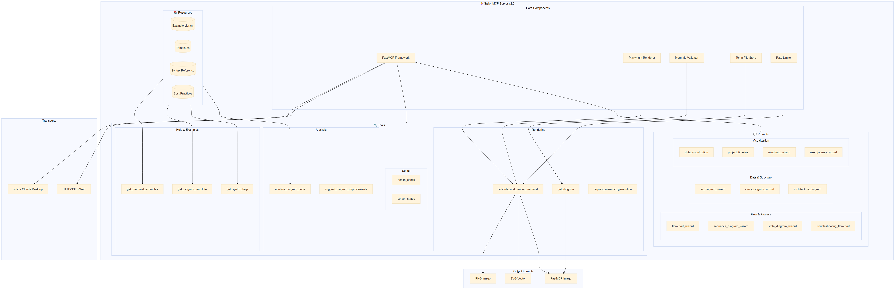

# 🧜‍♀️ Sailor - Mermaid Diagram Generator

[](https://www.docker.com/)
[](https://www.python.org/)
[](https://github.com/jlowin/fastmcp)
[](https://github.com/aj-geddes/sailor)
[](https://claude.ai)
[](https://flask.palletsprojects.com/)

Get a picture of your Mermaid! 🎨

Sailor combines a beautiful web interface with an MCP (Model Context Protocol) server for generating and rendering Mermaid diagrams. Use the web UI for interactive diagram creation, or integrate with Claude Desktop for AI-powered diagram generation through natural language.

## 🆕 What's New in v2.0

- **Modern FastMCP Architecture**: 70% less boilerplate code with decorator-based patterns
- **Simplified Development**: No more stdio_wrapper complexity - FastMCP handles it all
- **Faster Startup**: ~50% improvement in server initialization time
- **Better Type Safety**: Native Python type hints throughout
- **Cleaner API**: Simple `@mcp.tool()` and `@mcp.prompt()` decorators
- **Dual Transport Support**: Built-in stdio and HTTP/SSE transports
- **Direct Image Returns**: Use `return_image=true` to get images inline without file downloads

## 🏗️ Architecture



Sailor provides **11 tools**, **11 prompts**, and a comprehensive resource library for Mermaid diagram generation.

## ✨ Features

### 🌐 Web Interface
- 🎨 **AI-Powered Generation**: Generate diagrams using OpenAI or Anthropic APIs
- 🔄 **Live Preview**: Real-time rendering with syntax highlighting
- 📋 **Copy Functions**: Copy both code and rendered images
- 🎯 **Style Controls**: Theme and appearance customization
- ✅ **API Key Validation**: Instant feedback on key validity

### 🤖 MCP Server (Powered by FastMCP)
- 📐 **All Mermaid Diagram Types**: Flowcharts, sequence, gantt, class, state, ER, pie, mindmap, journey, timeline
- 🎨 **Multiple Themes**: Default, dark, forest, neutral
- ✏️ **Hand-drawn Look**: Optional sketch-style rendering
- 🖼️ **Flexible Output**: PNG with transparent background support
- 🤖 **LLM Integration**: Works with Claude Desktop via MCP
- 🐳 **Fully Containerized**: No dependencies needed except Docker
- ⚡ **FastMCP Architecture**: Modern, maintainable codebase with decorators


## 🚀 Quick Start

Choose your preferred way to use Sailor:

### Option A: Web Interface 🌐

1. **Clone and Setup**:
```bash
git clone https://github.com/aj-geddes/sailor.git
cd sailor
```

2. **Configure Environment** (backend folder):
```bash
cd backend
cp .env.example .env
# Edit .env with your API keys
```

3. **Run with Docker**:
```bash
docker-compose up -d
```

4. **Access**: Open http://localhost:5000


### Option B: Claude Desktop Integration 🤖

**Prerequisites**: Docker Desktop + Claude Desktop

1. **Clone and Build**:
```bash
git clone https://github.com/aj-geddes/sailor.git
cd sailor
docker build -f Dockerfile.mcp-stdio -t sailor-mcp .
```

2. **Configure Claude Desktop**:

Add the following to your Claude Desktop configuration file:

**Windows**: `%APPDATA%\Claude\claude_desktop_config.json`  
**macOS**: `~/Library/Application Support/Claude/claude_desktop_config.json`  
**Linux**: `~/.config/Claude/claude_desktop_config.json`

```json
{
  "mcpServers": {
    "sailor-mermaid": {
      "command": "docker",
      "args": [
        "run",
        "-i",
        "--rm",
        "-v",
        "C:\\Users\\YourName\\Pictures:/output",
        "sailor-mcp"
      ]
    }
  }
}
```

**Note**: Replace `C:\\Users\\YourName\\Pictures` with your desired output directory.

### 4. Restart Claude Desktop

Completely close and reopen Claude Desktop to load the new configuration.

### Option C: Remote MCP Server ☁️

Use Sailor without any local installation by connecting to a hosted MCP server.

**Configure Claude Desktop** to use a remote Sailor instance:

```json
{
  "mcpServers": {
    "sailor-remote": {
      "transport": {
        "type": "streamable-http",
        "url": "https://your-sailor-instance.up.railway.app/mcp"
      }
    }
  }
}
```

**Benefits of Remote MCP:**
- No Docker or local installation required
- Always available, runs 24/7
- Automatic updates and maintenance
- Works from any machine with Claude Desktop

**Deploy Your Own:**
See [Railway Deployment Guide](docs/RAILWAY_DEPLOYMENT.md) to host your own remote instance.

## 📖 Usage

### 🌐 Web Interface

1. **Enter API Key**: Provide your OpenAI or Anthropic API key
2. **Describe Your Diagram**: Enter a natural language description
3. **Generate**: Click "Generate Diagram" to create Mermaid code
4. **Customize**: Use style controls to adjust appearance
5. **Export**: Copy the code or image with the copy buttons

### 🤖 Claude Desktop Integration

Once configured, you can use natural language commands in Claude Desktop:

- "Use sailor-mermaid to create a flowchart showing a login process"
- "Generate a sequence diagram with sailor-mermaid showing API calls"
- "Create a Gantt chart for a project timeline using sailor-mermaid"
- "Show me examples of Mermaid diagrams with sailor-mermaid"

Images are automatically saved to your configured output directory.

## 🛠️ Available Tools

### Rendering Tools
| Tool | Description |
|------|-------------|
| `validate_and_render_mermaid` | Validate and render Mermaid code as an image. Options: `return_image=true` for inline display, `return_base64_text=true` for saveable base64 |
| `get_diagram` | Retrieve a rendered diagram by file ID. Use `as_base64_text=true` to get saveable base64 |
| `request_mermaid_generation` | Request AI to generate Mermaid diagram code based on your description |

### Saving Images Locally (Remote Server)

When using Sailor via a remote MCP server (like Railway), the server cannot write to your local filesystem. Use `return_base64_text=true` to get the image as extractable base64:

```bash
# The response includes base64_data which you can save via:
echo "<base64_data>" | base64 -d > diagram.png
```

### Help & Examples Tools
| Tool | Description |
|------|-------------|
| `get_mermaid_examples` | Get examples of different Mermaid diagram types by category or complexity |
| `get_diagram_template` | Get customizable templates for quick diagram generation |
| `get_syntax_help` | Get syntax reference and help for specific diagram types |

### Analysis Tools
| Tool | Description |
|------|-------------|
| `analyze_diagram_code` | Analyze Mermaid code and provide improvement suggestions |
| `suggest_diagram_improvements` | Get targeted suggestions for improving existing diagrams |

### Status Tools
| Tool | Description |
|------|-------------|
| `health_check` | Check server health and get status information |
| `server_status` | Get detailed server status and metrics |

## 💬 Available Prompts

Interactive wizards to help you create diagrams through guided conversations:

### Flow & Process Diagrams
| Prompt | Description |
|--------|-------------|
| `flowchart_wizard` | Interactive wizard to create flowchart diagrams |
| `sequence_diagram_wizard` | Guide for creating sequence diagrams |
| `state_diagram_wizard` | Create state machine diagrams for system behavior |
| `troubleshooting_flowchart` | Create diagnostic and troubleshooting flowcharts |

### Data & Structure Diagrams
| Prompt | Description |
|--------|-------------|
| `er_diagram_wizard` | Design entity-relationship diagrams for databases |
| `class_diagram_wizard` | Create class diagrams for object-oriented design |
| `architecture_diagram` | Create system architecture diagrams |

### Visualization Diagrams
| Prompt | Description |
|--------|-------------|
| `data_visualization` | Create charts and data visualizations |
| `project_timeline` | Create Gantt charts for project planning |
| `mindmap_wizard` | Create mindmaps for brainstorming and concept organization |
| `user_journey_wizard` | Map customer or user journeys |

## 🎨 Styling Options

- **Themes**: `default`, `dark`, `forest`, `neutral`
- **Look**: `classic`, `handDrawn`
- **Background**: `transparent`, `white`
- **Direction**: `TB` (top-bottom), `LR` (left-right), `BT`, `RL`

## 📁 Project Structure

```
sailor/
├── backend/                  # Web UI Flask application
│   ├── app.py               # Main Flask server
│   ├── static/              # Frontend files (HTML/CSS/JS)
│   ├── requirements.txt     # Web UI dependencies
│   └── .env.example         # Environment template
├── src/
│   └── sailor_mcp/          # FastMCP server implementation
│       ├── server.py        # Main MCP server with decorators
│       ├── renderer.py      # Mermaid rendering engine
│       ├── validators.py    # Syntax validation
│       ├── prompts.py       # AI prompt templates
│       └── mermaid_resources.py # Examples and templates
├── tests/                   # Comprehensive test suite
├── Dockerfile.mcp-stdio     # MCP server container
├── docker-compose.yml       # Multi-service setup
├── setup.py                 # Python package setup (v2.0.0)
└── requirements.txt         # FastMCP dependencies
```

## 📚 Documentation

Comprehensive documentation is available in the [`docs/`](docs/) directory:

- **[docs/DOCKER.md](docs/DOCKER.md)** - Docker deployment, container configuration, and best practices
- **[docs/PRODUCTION.md](docs/PRODUCTION.md)** - Production deployment, security hardening, and monitoring
- **[docs/README.md](docs/README.md)** - Complete documentation index
- **[CLAUDE.md](CLAUDE.md)** - AI assistant development guide

Development scripts are located in the [`scripts/`](scripts/) directory.

## 🧪 Development

### Web UI Development
```bash
# Setup environment
cd backend
cp .env.example .env
# Edit .env with your API keys

# Install dependencies
pip install -r requirements.txt

# Run Flask development server
python app.py
# Access at http://localhost:5000
```

### MCP Server Development (FastMCP v2.0)
```bash
# Create virtual environment
python -m venv venv
source venv/bin/activate  # On Windows: venv\Scripts\activate

# Install FastMCP and dependencies
pip install fastmcp>=0.5.0
pip install -e .

# Install Playwright browsers
playwright install chromium

# Run tests
pytest

# Run MCP server with stdio (Claude Desktop)
python -m sailor_mcp.server

# Run MCP server with HTTP/SSE (Web clients)
python -m sailor_mcp.server --http --port 8000
```

### Full Stack Development
```bash
# Run everything with Docker Compose
docker-compose up --build

# Web UI: http://localhost:5000
# MCP Server: Available for Claude Desktop integration
```

## 🐛 Troubleshooting

### Server Not Appearing in Claude Desktop
1. Ensure Docker Desktop is running
2. Check the image exists: `docker images | grep sailor-mcp`
3. Verify config file location and JSON syntax
4. Restart Claude Desktop completely

### Connection Issues
Test the server manually:
```bash
docker run -i --rm sailor-mcp
```

### View Logs
Check Docker logs:
```bash
docker logs $(docker ps -a | grep sailor-mcp | awk '{print $1}')
```

## 📝 License

MIT License - see [LICENSE](LICENSE) file for details.

## 🤝 Contributing

Contributions are welcome! Please feel free to submit a Pull Request.

1. Fork the repository
2. Create your feature branch (`git checkout -b feature/AmazingFeature`)
3. Commit your changes (`git commit -m 'Add some AmazingFeature'`)
4. Push to the branch (`git push origin feature/AmazingFeature`)
5. Open a Pull Request

## 🙏 Acknowledgments

- Built with [MCP](https://modelcontextprotocol.io/) (Model Context Protocol)
- Powered by [Mermaid.js](https://mermaid.js.org/) for diagram rendering
- Uses [Playwright](https://playwright.dev/) for headless rendering

---

Made with ❤️ for Claude Desktop users
