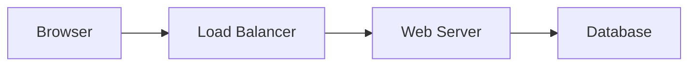

# 🚢 Sailor for GitHub Pages

> Automatically transform Mermaid diagrams in your documentation into beautiful images for GitHub Pages!

[](https://github.com/marketplace/actions/sailor-mermaid-processor)
[](https://hub.docker.com/r/ajgeddes/sailor)
[](LICENSE)

## 🎯 What is Sailor?

Sailor is a documentation-as-code tool that automatically processes Mermaid diagrams in your markdown files and generates images for static site generators like Jekyll, Hugo, and GitHub Pages.

### Key Features

- 🤖 **Automatic Processing** - GitHub Action integrates seamlessly with your workflow
- 🚀 **Fast & Cached** - Only regenerates changed diagrams
- 🎨 **Multiple Themes** - Default, dark, forest, and neutral themes
- 📊 **All Mermaid Types** - Flowcharts, sequence diagrams, ER diagrams, and more
- 🔍 **Validation** - Catches syntax errors before deployment
- 📦 **Zero Config** - Works out of the box with sensible defaults

## 🚀 Quick Start

### 1. Add to Your GitHub Workflow

Create `.github/workflows/process-diagrams.yml`:

```yaml
name: Process Diagrams

on:
  push:
    branches: [ main ]

jobs:
  process:
    runs-on: ubuntu-latest
    permissions:
      contents: write
      
    steps:
      - uses: actions/checkout@v4
      
      - name: Process Mermaid Diagrams
        uses: aj-geddes/sailor@v1
        with:
          source-dir: 'docs'
          output-dir: 'docs/diagrams'
```

### 2. Write Mermaid in Markdown

In your markdown files:

````markdown
# Architecture Overview


````

### 3. Push and Deploy

Sailor automatically:
1. Finds all Mermaid blocks
2. Validates syntax
3. Generates images
4. Commits them to your repository
5. Ready for GitHub Pages!

## 📖 Usage Examples

### Basic Jekyll Integration

```yaml
- name: Build Jekyll Site with Diagrams
  uses: aj-geddes/sailor@v1
  with:
    source-dir: '.'
    output-dir: 'assets/diagrams'
    format: 'svg'
    theme: 'dark'
```

### Hugo Sites

```yaml
- name: Process for Hugo
  uses: aj-geddes/sailor@v1
  with:
    source-dir: 'content'
    output-dir: 'static/images/diagrams'
    file-pattern: '**/*.md'
```

### Validation Only (PR Checks)

```yaml
- name: Validate Diagrams
  uses: aj-geddes/sailor@v1
  with:
    validate-only: true
    fail-on-error: true
```

## 🛠️ Configuration Options

| Option | Description | Default |
|--------|-------------|---------|
| `source-dir` | Directory to scan for markdown | `.` |
| `output-dir` | Where to save generated images | `diagrams` |
| `format` | Output format (png, svg, pdf) | `png` |
| `theme` | Mermaid theme | `default` |
| `file-pattern` | Glob pattern for files | `**/*.md` |
| `transparent-background` | Transparent images | `false` |
| `validate-only` | Only validate, don't generate | `false` |
| `fail-on-error` | Fail action on diagram errors | `true` |
| `commit-changes` | Auto-commit generated files | `true` |

## 🏃 Local Development

### Install CLI

```bash
pip install sailor-mermaid
```

### Process Locally

```bash
# Process all markdown files
sailor-cli docs/ docs/diagrams/

# Watch mode
sailor-cli docs/ docs/diagrams/ --watch

# Validate only
sailor-cli docs/ docs/diagrams/ --validate-only
```

### Docker

```bash
docker run -v $(pwd):/workspace ajgeddes/sailor \
  /workspace/docs /workspace/diagrams
```

## 📊 Supported Diagram Types

- ✅ Flowcharts
- ✅ Sequence Diagrams
- ✅ Class Diagrams
- ✅ State Diagrams
- ✅ Entity Relationship Diagrams
- ✅ Gantt Charts
- ✅ Pie Charts
- ✅ Git Graphs
- ✅ User Journey Maps

## 🎨 Themes

Choose from built-in themes:

```yaml
theme: 'default'  # Clean and professional
theme: 'dark'     # Dark mode friendly
theme: 'forest'   # Nature inspired
theme: 'neutral'  # Monochrome
```

## 🔧 Advanced Usage

### Custom Caching

```yaml
- uses: actions/cache@v3
  with:
    path: .sailor-cache
    key: sailor-${{ hashFiles('**/*.md') }}
    
- uses: aj-geddes/sailor@v1
  with:
    cache-dir: '.sailor-cache'
```

### Multiple Formats

```yaml
- uses: aj-geddes/sailor@v1
  with:
    format: 'svg'  # Better for scaling
    
- uses: aj-geddes/sailor@v1
  with:
    format: 'png'  # Better compatibility
    output-dir: 'diagrams/png'
```

### Conditional Processing

```yaml
- uses: aj-geddes/sailor@v1
  if: contains(github.event.head_commit.message, '[diagrams]')
```

## 🐛 Troubleshooting

### Diagrams Not Showing

1. Check the generated images exist in the output directory
2. Verify paths in your markdown match the output location
3. Ensure GitHub Pages is building from the correct branch

### Build Failures

1. Run with `validate-only: true` to check syntax
2. Test locally with the CLI tool
3. Check action logs for specific errors

### Performance Issues

1. Use caching to avoid reprocessing unchanged diagrams
2. Process only changed files in PRs
3. Consider using SVG format for smaller file sizes

## 📝 Examples

See the [examples directory](./examples) for complete setups:

- [Jekyll Site](./examples/jekyll-site)
- [Hugo Site](./examples/hugo-site)
- [MkDocs Site](./examples/mkdocs-site)
- [Plain GitHub Pages](./examples/plain-pages)

## 🤝 Contributing

Contributions are welcome! Please see [CONTRIBUTING.md](CONTRIBUTING.md).

## 📄 License

MIT License - see [LICENSE](LICENSE) for details.

## 🙏 Acknowledgments

- Built on [Mermaid.js](https://mermaid.js.org)
- Powered by [Playwright](https://playwright.dev)
- Inspired by the documentation-as-code movement

---

**Ready to sail?** ⚓ Add Sailor to your GitHub workflow today!