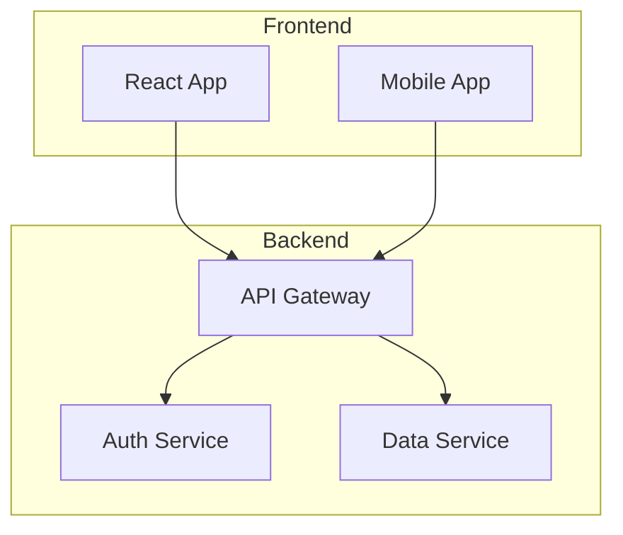

# 📄 Sailor GitHub Pages Integration Guide

Transform your Mermaid diagrams into beautiful images automatically in your GitHub Pages documentation!

## 🚀 Quick Start

### Method 1: Using the Sailor GitHub Action (Recommended)

Add this workflow to your repository at `.github/workflows/process-diagrams.yml`:

```yaml
name: Process Mermaid Diagrams

on:
  push:
    branches: [ main ]
    paths:
      - '**.md'
      - 'docs/**'

jobs:
  process-diagrams:
    runs-on: ubuntu-latest
    permissions:
      contents: write
      
    steps:
      - uses: actions/checkout@v4
      
      - name: Process Mermaid Diagrams
        uses: aj-geddes/sailor@v1
        with:
          source-dir: 'docs'
          output-dir: 'docs/diagrams'
          format: 'png'
          theme: 'default'
          
      - name: Deploy to GitHub Pages
        uses: peaceiris/actions-gh-pages@v3
        if: github.ref == 'refs/heads/main'
        with:
          github_token: ${{ secrets.GITHUB_TOKEN }}
          publish_dir: ./docs
```

### Method 2: Jekyll Plugin Integration

For Jekyll-based GitHub Pages sites, add Sailor as a pre-build step:

```yaml
# _config.yml
plugins:
  - jekyll-feed
  - jekyll-seo-tag

# Exclude source markdown from output
exclude:
  - "**/*.mermaid.md"
  
# Custom build command
before_build:
  - sailor-cli . _site/diagrams --format png
```

## 📝 Writing Mermaid Diagrams in Markdown

### Inline Mermaid Blocks

Write your diagrams directly in markdown files:

````markdown
# System Architecture

Our system uses a microservices architecture:



This architecture provides scalability and separation of concerns.
````

### Referencing Generated Images

After processing, reference the generated images:

```markdown

```

## 🎨 Advanced Configuration

### Custom Themes and Styling

```yaml
- name: Process Mermaid Diagrams
  uses: aj-geddes/sailor@v1
  with:
    source-dir: 'docs'
    output-dir: 'docs/assets/diagrams'
    format: 'svg'  # SVG for better scaling
    theme: 'dark'  # Match your docs theme
    transparent-background: true
```

### Multiple Documentation Sources

```yaml
- name: Process Multiple Directories
  uses: aj-geddes/sailor@v1
  with:
    source-dir: '.'
    output-dir: 'assets/diagrams'
    file-pattern: |
      docs/**/*.md
      README.md
      examples/**/*.md
```

## 🔧 Local Development

### Install Sailor CLI

```bash
pip install sailor-mermaid
```

### Process Diagrams Locally

```bash
# Process all markdown files
sailor-cli docs/ docs/diagrams/

# Watch mode for development
sailor-cli docs/ docs/diagrams/ --watch

# Validate without generating
sailor-cli docs/ docs/diagrams/ --validate-only
```

### Jekyll Development

```bash
# Install dependencies
bundle add sailor-jekyll-plugin

# Serve with diagram processing
bundle exec jekyll serve --livereload
```

## 📚 Complete Examples

### Example 1: Documentation Site with Diagrams

```yaml
name: Build Documentation

on:
  push:
    branches: [ main ]
  pull_request:
    branches: [ main ]

jobs:
  build-docs:
    runs-on: ubuntu-latest
    
    steps:
      - uses: actions/checkout@v4
      
      - name: Setup Ruby
        uses: ruby/setup-ruby@v1
        with:
          ruby-version: '3.0'
          bundler-cache: true
          
      - name: Process Mermaid Diagrams
        uses: aj-geddes/sailor@v1
        with:
          source-dir: 'docs'
          output-dir: 'docs/diagrams'
          fail-on-error: true
          
      - name: Build Jekyll Site
        run: |
          cd docs
          bundle exec jekyll build
          
      - name: Deploy to GitHub Pages
        uses: peaceiris/actions-gh-pages@v3
        with:
          github_token: ${{ secrets.GITHUB_TOKEN }}
          publish_dir: ./docs/_site
```

### Example 2: Markdown Preview with Diagrams

```yaml
name: PR Preview

on:
  pull_request:
    types: [opened, synchronize]

jobs:
  preview:
    runs-on: ubuntu-latest
    
    steps:
      - uses: actions/checkout@v4
      
      - name: Validate Diagrams
        uses: aj-geddes/sailor@v1
        with:
          validate-only: true
          fail-on-error: true
          
      - name: Process Diagrams for Preview
        uses: aj-geddes/sailor@v1
        with:
          output-dir: 'preview/diagrams'
          commit-changes: false
          
      - name: Upload Preview
        uses: actions/upload-artifact@v3
        with:
          name: preview-${{ github.event.pull_request.number }}
          path: preview/
```

## 🛡️ Best Practices

### 1. **Version Control Diagrams**
- Store Mermaid source in `.md` files
- Generated images in `.gitignore` (regenerated on build)
- Or commit generated images for faster builds

### 2. **Organize Diagrams**
```
docs/
├── architecture/
│   ├── overview.md      # Contains mermaid blocks
│   └── diagrams/        # Generated images
├── api/
│   ├── flows.md
│   └── diagrams/
└── diagrams/            # Global diagram directory
```

### 3. **Optimize Performance**
- Use caching for faster builds
- Process only changed files
- Use SVG format for better quality

### 4. **Error Handling**
```yaml
- name: Process with Error Reporting
  uses: aj-geddes/sailor@v1
  with:
    fail-on-error: true  # Fail build on diagram errors
  continue-on-error: false
```

## 🔍 Troubleshooting

### Common Issues

**1. Diagrams not generating**
- Check markdown syntax - use \`\`\`mermaid blocks
- Verify file patterns match your structure
- Check action logs for errors

**2. Images not showing in GitHub Pages**
- Ensure output directory is included in Jekyll build
- Check image paths are relative
- Verify GitHub Pages deployment succeeded

**3. Build timeouts**
- Use caching for dependencies
- Process only changed files
- Consider using multiple jobs

### Debug Mode

```yaml
- name: Process with Debug Output
  uses: aj-geddes/sailor@v1
  with:
    source-dir: 'docs'
    output-dir: 'docs/diagrams'
  env:
    SAILOR_DEBUG: 'true'
```

## 🎯 Integration Patterns

### Pattern 1: Pre-commit Hook

```bash
#!/bin/bash
# .git/hooks/pre-commit

# Validate all Mermaid diagrams before commit
sailor-cli . temp/ --validate-only || {
    echo "❌ Mermaid validation failed"
    exit 1
}
```

### Pattern 2: Documentation as Code

```yaml
# mkdocs.yml
hooks:
  - scripts/process_mermaid.py

plugins:
  - search
  - mermaid2
  
extra_javascript:
  - https://unpkg.com/mermaid/dist/mermaid.min.js
```

### Pattern 3: CI/CD Pipeline

```yaml
stages:
  - validate
  - build
  - deploy

validate-diagrams:
  stage: validate
  script:
    - sailor-cli docs/ --validate-only
    
build-docs:
  stage: build
  script:
    - sailor-cli docs/ docs/assets/diagrams/
    - mkdocs build
    
deploy-pages:
  stage: deploy
  script:
    - mkdocs gh-deploy
```

## 📊 Metrics and Monitoring

Track diagram processing in your workflows:

```yaml
- name: Process and Report
  id: diagrams
  uses: aj-geddes/sailor@v1
  
- name: Report Metrics
  run: |
    echo "📊 Diagram Processing Report"
    echo "Processed: ${{ steps.diagrams.outputs.diagrams-processed }}"
    echo "Failed: ${{ steps.diagrams.outputs.diagrams-failed }}"
```

## 🚀 Next Steps

1. **Install the GitHub Action** in your repository
2. **Add Mermaid diagrams** to your markdown files
3. **Push changes** and watch the magic happen!
4. **Customize** themes and settings to match your brand

---

Need help? Check out:
- [Sailor Documentation](https://github.com/aj-geddes/sailor)
- [Mermaid Syntax Guide](https://mermaid.js.org/syntax/syntax.html)
- [GitHub Pages Documentation](https://docs.github.com/pages)