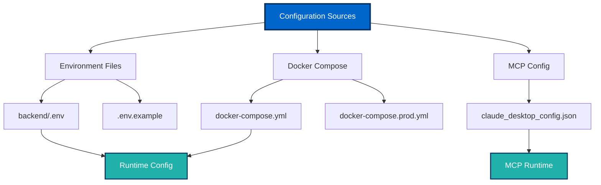
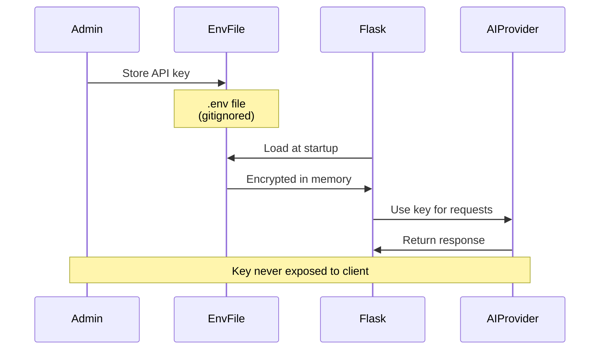
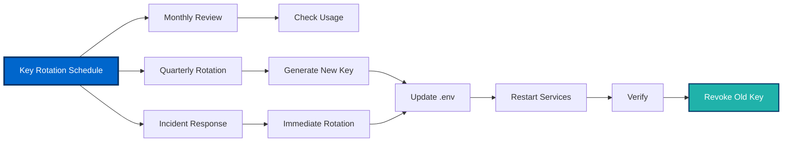
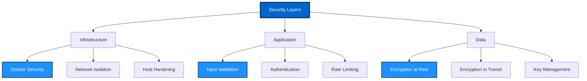
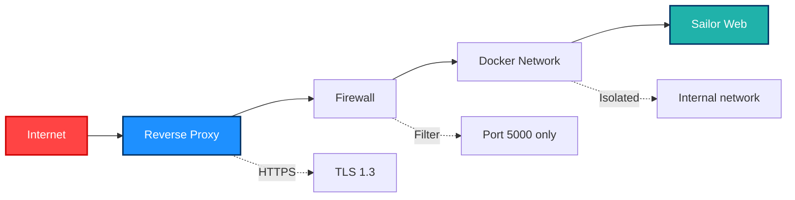
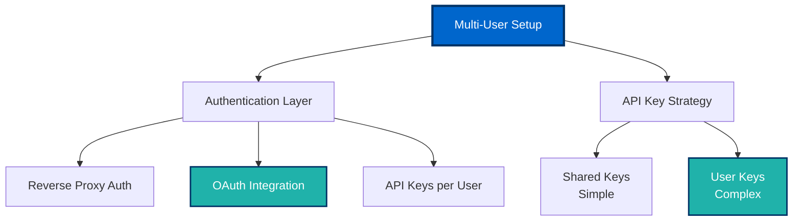
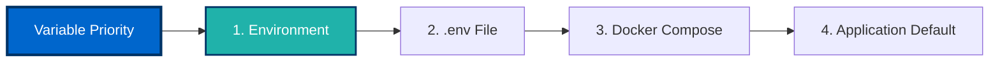
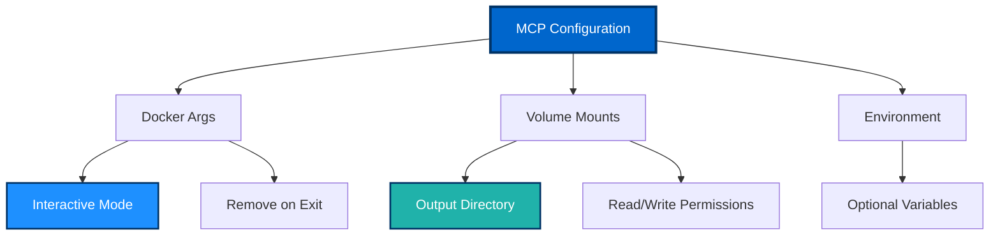
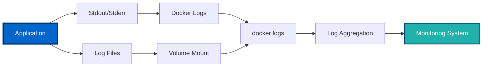

# Admin Guide 👨‍💼

This guide provides comprehensive information for administrators managing Sailor installations, covering configuration, security, API management, and system administration.

## Table of Contents

- [Configuration Management](#configuration-management)
- [API Key Management](#api-key-management)
- [Security Best Practices](#security-best-practices)
- [User Management](#user-management)
- [Environment Variables](#environment-variables)
- [Docker Configuration](#docker-configuration)
- [MCP Server Configuration](#mcp-server-configuration)
- [Logging and Auditing](#logging-and-auditing)

---

## Configuration Management

### Configuration Architecture



### Core Configuration Files

#### backend/.env

Primary configuration for the Flask web application:

```bash
# Security
SECRET_KEY=your-secure-secret-key-minimum-32-chars

# AI Provider API Keys
OPENAI_API_KEY=sk-proj-...
ANTHROPIC_API_KEY=sk-ant-...

# Flask Configuration
FLASK_ENV=production
FLASK_DEBUG=0
FLASK_HOST=0.0.0.0
FLASK_PORT=5000

# Logging
LOG_LEVEL=INFO
LOG_FILE=/var/log/sailor/app.log

# Rate Limiting (optional)
RATE_LIMIT_ENABLED=true
RATE_LIMIT_PER_MINUTE=60

# Session Configuration
SESSION_TYPE=filesystem
PERMANENT_SESSION_LIFETIME=3600
```

#### docker-compose.yml

Development/testing configuration:

```yaml
version: '3.8'

services:
  web:
    build: ./backend
    ports:
      - "5000:5000"
    volumes:
      - ./backend:/app
    env_file:
      - ./backend/.env
    restart: unless-stopped
```

#### docker-compose.prod.yml

Production configuration with additional security:

```yaml
version: '3.8'

services:
  web:
    build: ./backend
    ports:
      - "127.0.0.1:5000:5000"  # Only bind to localhost
    env_file:
      - ./backend/.env
    restart: always
    read_only: true
    tmpfs:
      - /tmp
    security_opt:
      - no-new-privileges:true
```

---

## API Key Management

### API Key Security Flow



### Obtaining API Keys

#### OpenAI API Key

1. Visit [OpenAI Platform](https://platform.openai.com/api-keys)
2. Sign in or create account
3. Navigate to API Keys section
4. Click "Create new secret key"
5. Copy key immediately (shown only once)
6. Add to `backend/.env`:
   ```bash
   OPENAI_API_KEY=sk-proj-your-key-here
   ```

#### Anthropic API Key

1. Visit [Anthropic Console](https://console.anthropic.com/)
2. Sign in or create account
3. Navigate to API Keys
4. Click "Create Key"
5. Copy key and add to `backend/.env`:
   ```bash
   ANTHROPIC_API_KEY=sk-ant-your-key-here
   ```

### Key Rotation Best Practices



**Rotation Procedure:**

1. Generate new API key from provider
2. Update `backend/.env` with new key
3. Restart services:
   ```bash
   docker-compose restart
   ```
4. Test functionality
5. Revoke old key from provider dashboard
6. Document rotation in change log

---

## Security Best Practices

### Security Layers



### SECRET_KEY Management

The SECRET_KEY is critical for session security. **Never** use default values in production.

**Generate a secure key:**

```bash
python -c "import secrets; print(secrets.token_hex(32))"
```

**Security requirements:**
- Minimum 32 characters
- Random and unpredictable
- Unique per installation
- Never committed to version control
- Rotated periodically (quarterly recommended)

### File Permissions

Set appropriate permissions on sensitive files:

```bash
# Restrict .env file access
chmod 600 backend/.env
chown root:root backend/.env

# Verify permissions
ls -la backend/.env
# Should show: -rw------- (600)
```

### Docker Security

Enable Docker security features:

```yaml
# docker-compose.prod.yml
services:
  web:
    security_opt:
      - no-new-privileges:true
    read_only: true
    user: "1000:1000"  # Non-root user
    cap_drop:
      - ALL
    cap_add:
      - NET_BIND_SERVICE
```

### Network Security



**Recommended Setup:**

1. **Reverse Proxy**: Use nginx or Caddy
2. **TLS/SSL**: Enable HTTPS with valid certificates
3. **Firewall**: Restrict access to necessary ports only
4. **Network Isolation**: Use Docker networks

Example nginx configuration:

```nginx
server {
    listen 443 ssl http2;
    server_name sailor.example.com;

    ssl_certificate /etc/ssl/certs/sailor.crt;
    ssl_certificate_key /etc/ssl/private/sailor.key;

    location / {
        proxy_pass http://127.0.0.1:5000;
        proxy_set_header Host $host;
        proxy_set_header X-Real-IP $remote_addr;
        proxy_set_header X-Forwarded-For $proxy_add_x_forwarded_for;
        proxy_set_header X-Forwarded-Proto $scheme;
    }
}
```

---

## User Management

### Multi-User Considerations

For multi-user deployments:



**Options:**

1. **Shared API Keys** (Simple)
   - Single set of AI provider keys
   - Users share quota
   - Simpler administration

2. **Per-User API Keys** (Advanced)
   - Users provide their own keys
   - Individual quota management
   - Requires application modification

3. **Reverse Proxy Authentication**
   - nginx with basic auth
   - OAuth via Auth0/Okta
   - LDAP/Active Directory integration

---

## Environment Variables

### Complete Variable Reference

| Variable | Required | Default | Description |
|----------|----------|---------|-------------|
| `SECRET_KEY` | ✅ Yes | - | Flask session encryption key |
| `OPENAI_API_KEY` | ⚠️ Optional | - | OpenAI API key for GPT models |
| `ANTHROPIC_API_KEY` | ⚠️ Optional | - | Anthropic API key for Claude |
| `FLASK_ENV` | No | `production` | Environment mode |
| `FLASK_DEBUG` | No | `0` | Debug mode (0=off, 1=on) |
| `FLASK_HOST` | No | `0.0.0.0` | Bind address |
| `FLASK_PORT` | No | `5000` | Listen port |
| `LOG_LEVEL` | No | `INFO` | Logging level |
| `LOG_FILE` | No | `/var/log/sailor/app.log` | Log file path |

### Environment Variable Priority



**Priority order** (highest to lowest):
1. System environment variables
2. `.env` file values
3. `docker-compose.yml` environment section
4. Application defaults

---

## Docker Configuration

### Image Management

```bash
# List Sailor images
docker images | grep sailor

# Remove old images
docker image prune -a

# Rebuild from scratch
docker-compose build --no-cache

# Tag for deployment
docker tag sailor-mcp:latest sailor-mcp:v2.0.0
```

### Volume Management

```bash
# List volumes
docker volume ls

# Inspect volume
docker volume inspect sailor_data

# Backup volume
docker run --rm -v sailor_data:/data -v $(pwd):/backup \
  alpine tar czf /backup/sailor-backup.tar.gz /data

# Restore volume
docker run --rm -v sailor_data:/data -v $(pwd):/backup \
  alpine tar xzf /backup/sailor-backup.tar.gz -C /
```

### Resource Limits

Configure resource constraints in `docker-compose.yml`:

```yaml
services:
  web:
    deploy:
      resources:
        limits:
          cpus: '2.0'
          memory: 2G
        reservations:
          cpus: '0.5'
          memory: 512M
```

---

## MCP Server Configuration

### Claude Desktop Configuration



**Advanced MCP configuration:**

```json
{
  "mcpServers": {
    "sailor-mermaid": {
      "command": "docker",
      "args": [
        "run",
        "-i",
        "--rm",
        "--name", "sailor-mcp-session",
        "-v", "/path/to/output:/output",
        "-e", "LOG_LEVEL=DEBUG",
        "--memory", "1g",
        "--cpus", "1.0",
        "sailor-mcp"
      ],
      "env": {
        "OUTPUT_DIR": "/output"
      }
    }
  }
}
```

### MCP Logging

Enable detailed MCP logging:

```bash
# Set environment in MCP config
"env": {
  "LOG_LEVEL": "DEBUG",
  "MCP_DEBUG": "1"
}
```

View MCP logs:

```bash
# macOS
tail -f ~/Library/Logs/Claude/mcp*.log

# Windows
type %APPDATA%\Claude\logs\mcp*.log

# Linux
tail -f ~/.claude/logs/mcp*.log
```

---

## Logging and Auditing

### Log Architecture



### Accessing Logs

```bash
# View all logs
docker-compose logs

# Follow logs in real-time
docker-compose logs -f

# View specific service
docker-compose logs web

# Last 100 lines
docker-compose logs --tail=100

# Logs with timestamps
docker-compose logs -t
```

### Log Rotation

Configure log rotation for production:

```yaml
# docker-compose.prod.yml
services:
  web:
    logging:
      driver: "json-file"
      options:
        max-size: "10m"
        max-file: "3"
```

### Audit Trail

Track administrative actions:

```bash
# Enable audit logging in .env
AUDIT_LOG_ENABLED=true
AUDIT_LOG_FILE=/var/log/sailor/audit.log
```

---

## Best Practices Checklist

- [ ] Strong SECRET_KEY generated and configured
- [ ] API keys stored securely in `.env` file
- [ ] File permissions set correctly (600 for `.env`)
- [ ] `.env` file added to `.gitignore`
- [ ] Docker security options enabled
- [ ] Resource limits configured
- [ ] Logging configured and monitored
- [ ] Regular API key rotation schedule
- [ ] Backup procedures in place
- [ ] SSL/TLS enabled for production
- [ ] Firewall rules configured
- [ ] Regular security updates applied

---

## Next Steps

<div class="guide-card">

### ⚙️ Operations Guide
Learn about production deployment, monitoring, and maintenance.

[Deploy to Production →](operations-guide)

</div>

<div class="guide-card">

### 🔧 Troubleshooting Guide
Find solutions to common administrative issues.

[Get Help →](troubleshooting-guide)

</div>

---

[← Setup Guide](setup-guide) | [Operations Guide →](operations-guide)
