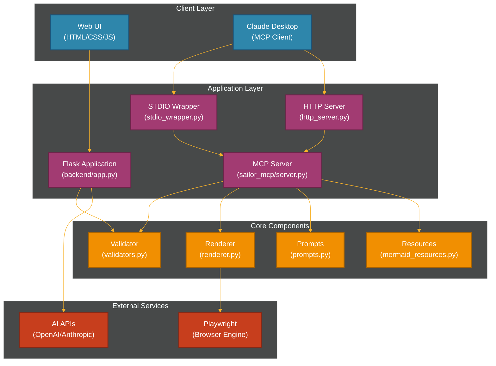

# Sailor MCP Documentation

**Version**: 1.0.0  
**Last Updated**: 2025-08-02  
**Document Classification**: Public  
**Intended Audience**: Developers, System Administrators

## Project Overview

Sailor MCP is an MCP server for generating and rendering Mermaid diagrams with AI assistance. This system combines a beautiful web interface with a Model Context Protocol (MCP) server for generating and rendering Mermaid diagrams.

## System Architecture



## Quick Start Guide

### For Web Interface Users

1. **Clone the repository**:
   ```bash
   git clone https://github.com/aj-geddes/sailor.git
   cd sailor
   ```

2. **Run with Docker**:
   ```bash
   docker-compose up -d
   ```

3. **Access the application**:
   Open your browser to http://localhost:5000

### For Claude Desktop Users

1. **Build the MCP Docker image**:
   ```bash
   docker build -f Dockerfile.mcp-stdio -t sailor-mcp .
   ```

2. **Configure Claude Desktop** by adding to your configuration file:
   ```json
   {
     "mcpServers": {
       "sailor-mermaid": {
         "command": "docker",
         "args": [
           "run",
           "-i",
           "--rm",
           "-v",
           "/path/to/output:/output",
           "sailor-mcp"
         ]
       }
     }
   }
   ```

3. **Restart Claude Desktop** to load the configuration

## Key Features

- **AI-Powered Diagram Generation**: Generate Mermaid diagrams from natural language descriptions
- **Multiple Diagram Types**: Support for flowcharts, sequence diagrams, class diagrams, and more
- **Customizable Themes**: Choose from default, dark, forest, or neutral themes
- **Hand-drawn Style**: Optional sketch-style rendering for a more informal look
- **Flexible Output**: PNG format with optional transparent background
- **MCP Integration**: Full integration with Claude Desktop via Model Context Protocol

## Documentation Structure

This documentation is organized following industry standards:

- **Architecture**: System design and component relationships
- **API Documentation**: Complete API reference with examples
- **Processes**: Key workflows and sequence diagrams
- **Infrastructure**: Deployment and configuration details
- **Contributing**: Guidelines for contributing to the project

## Compliance Information

This documentation follows:
- IEC/IEEE 82079-1 for clear and accessible instruction manuals
- VDI Guideline 2770 for digital delivery standards
- ISO 2651x for ergonomic design principles
- ISO/AWI 21999 for lifecycle management

## Support and Resources

- **Repository**: [https://github.com/aj-geddes/sailor](https://github.com/aj-geddes/sailor)
- **Issue Tracker**: [GitHub Issues](https://github.com/aj-geddes/sailor/issues)
- **Documentation**: You are here!

---

**Note**: This documentation is generated based on the actual codebase structure and is maintained to reflect the current state of the system.