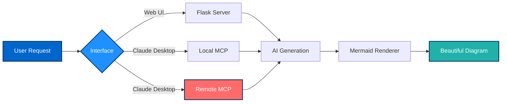
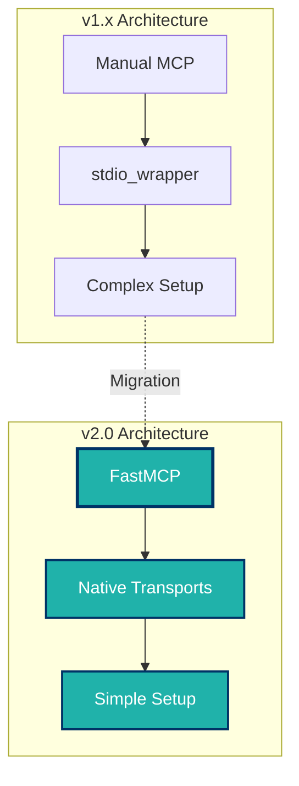
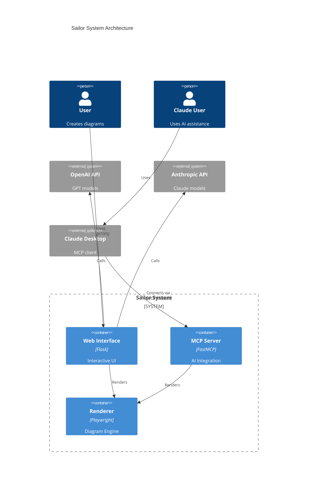

# Welcome Aboard! 🧜‍♀️

Welcome to the **Sailor Documentation** - your comprehensive guide to navigating the Mermaid diagram generator. Whether you're setting up your first instance or managing a production deployment, we've got you covered.

## What is Sailor?

Sailor is a powerful Mermaid diagram generator that combines a beautiful web interface with an MCP (Model Context Protocol) server. It enables you to:

- 🎨 Generate diagrams using AI (OpenAI or Anthropic)
- 🔄 Render Mermaid diagrams in real-time
- 🤖 Integrate with Claude Desktop for natural language diagram creation
- ☁️ Connect to remote MCP servers - no local installation required
- 🐳 Deploy anywhere with Docker
- ⚡ Leverage FastMCP's modern architecture

## 🗺️ Documentation Navigator

### 🚀 Setup Guide
**New to Sailor?** Start here for installation and initial configuration.

[Get Started →](setup-guide)

Topics covered:
- Prerequisites and system requirements
- Docker installation
- Web UI setup
- Claude Desktop integration
- First diagram generation

### 👨‍💼 Admin Guide
**Managing Sailor?** Configuration, security, and user management.

[Learn More →](admin-guide)

Topics covered:
- Configuration management
- API key management
- Security best practices
- Multi-user setups
- Environment variables

### ⚙️ Operations Guide
**Running in production?** Deployment, monitoring, and maintenance.

[Explore →](operations-guide)

Topics covered:
- Production deployment
- Docker orchestration
- Health monitoring
- Backup and recovery
- Performance tuning
- Update procedures

### 🔧 Troubleshooting Guide
**Having issues?** Common problems and solutions.

[Get Help →](troubleshooting-guide)

Topics covered:
- Common error messages
- Docker issues
- Rendering problems
- API connectivity
- Performance issues
- Debug procedures

## 🎯 Quick Links

| Resource | Description |
|----------|-------------|
| [GitHub Repository](https://github.com/aj-geddes/sailor) | Source code and issue tracking |
| [Main README](https://github.com/aj-geddes/sailor/blob/main/README.md) | Project overview and quick start |
| [Docker Guide](DOCKER.html) | Docker-specific documentation |
| [Production Guide](PRODUCTION.html) | Production deployment checklist |

## 🆕 Version 2.0 Highlights

Sailor v2.0 brings major improvements with the FastMCP migration:

**Key improvements:**
- ✨ 70% less boilerplate code
- 🚀 50% faster startup time
- 🎯 Decorator-based tools and prompts
- 🔄 Built-in stdio and HTTP/SSE support
- 🛡️ Better type safety with native Python hints

## 📊 System Architecture

## 🌊 Next Steps

1. **First Time Setup**: Head to the [Setup Guide](setup-guide) to get Sailor running
2. **Configuration**: Check the [Admin Guide](admin-guide) for detailed configuration
3. **Production Ready**: Follow the [Operations Guide](operations-guide) for deployment
4. **Need Help?** Visit the [Troubleshooting Guide](troubleshooting-guide)

---

  <h2 style="color: white; border: none; margin-bottom: 1rem;">⚓ Ready to Set Sail?</h2>
  
Start your journey with Sailor today!

  <a href="setup-guide" style="display: inline-block; background: white; color: #0066cc; padding: 0.75rem 2rem; border-radius: 4px; text-decoration: none; font-weight: bold; transition: transform 0.2s;" onmouseover="this.style.transform='scale(1.05)'" onmouseout="this.style.transform='scale(1)'">
    Begin Setup →
  </a>

---

**Questions or feedback?** [Open an issue](https://github.com/aj-geddes/sailor/issues) on GitHub!
