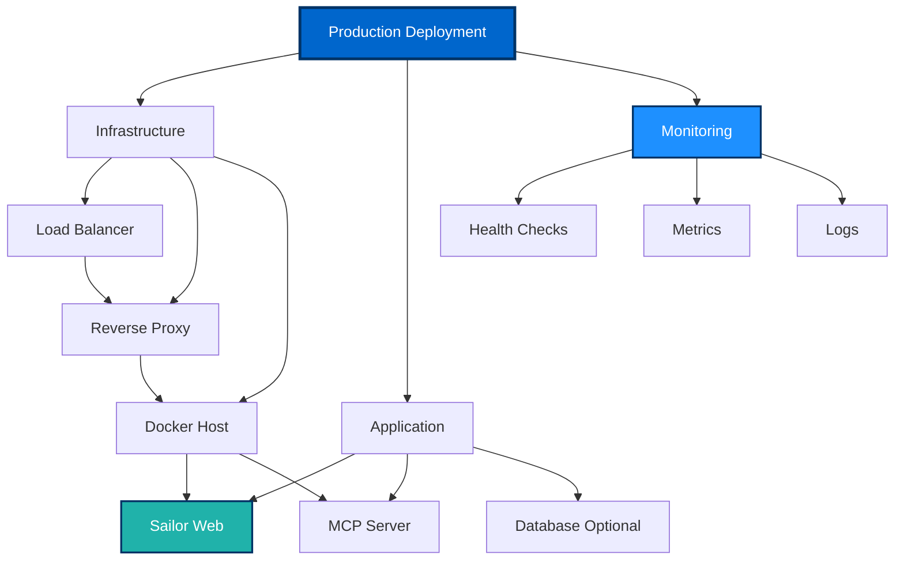
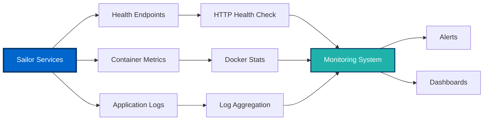
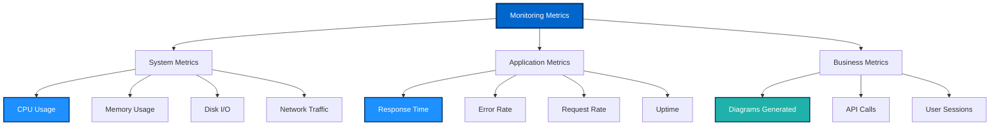
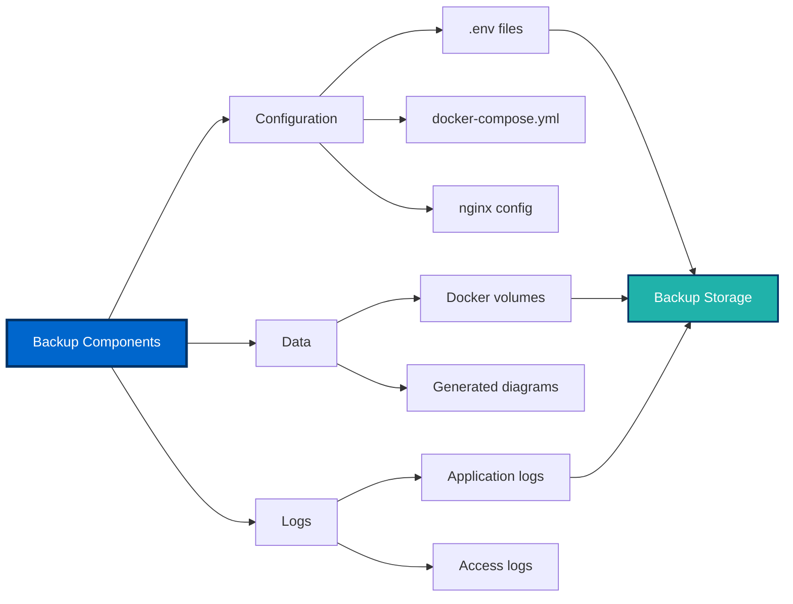
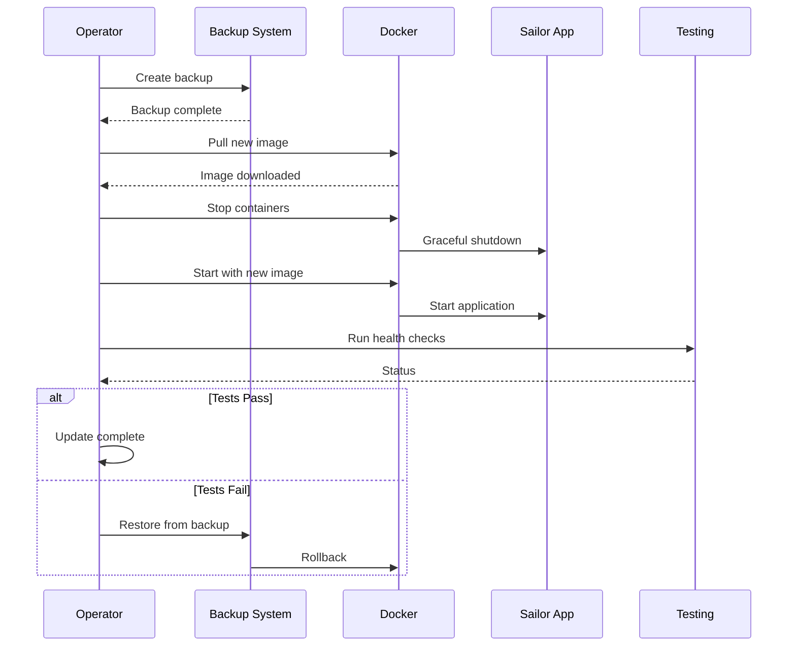
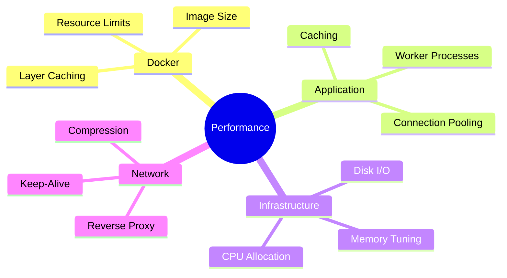
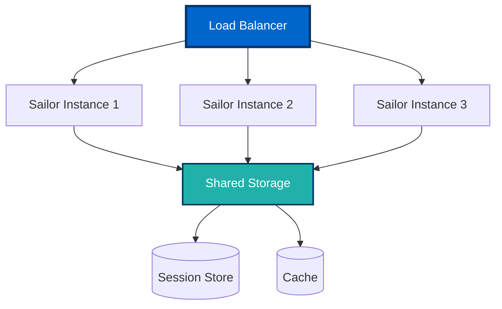
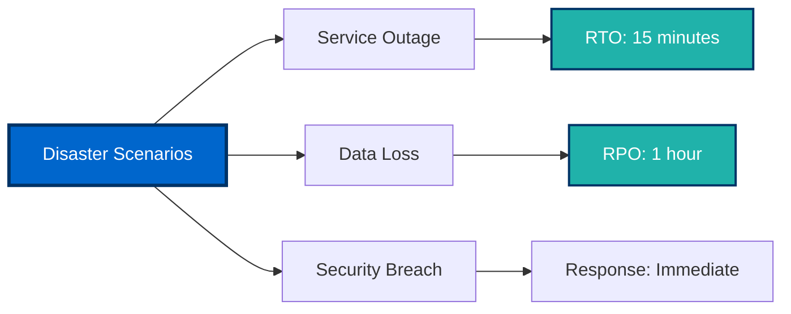

# Operations Guide ⚙️

This guide covers production deployment, monitoring, maintenance, and operational procedures for running Sailor in production environments.

## Table of Contents

- [Production Deployment](#production-deployment)
- [Health Monitoring](#health-monitoring)
- [Backup and Recovery](#backup-and-recovery)
- [Update Procedures](#update-procedures)
- [Performance Tuning](#performance-tuning)
- [Scaling Strategies](#scaling-strategies)
- [Disaster Recovery](#disaster-recovery)
- [Maintenance Schedule](#maintenance-schedule)

---

## Production Deployment

### Deployment Architecture



### Pre-Deployment Checklist

- [ ] Production environment variables configured
- [ ] SSL/TLS certificates obtained
- [ ] Reverse proxy configured (nginx/Caddy)
- [ ] Firewall rules in place
- [ ] Backup strategy defined
- [ ] Monitoring tools configured
- [ ] Log rotation enabled
- [ ] Resource limits set
- [ ] Security hardening applied
- [ ] Documentation updated

### Production Docker Compose

Create `docker-compose.prod.yml`:

```yaml
version: '3.8'

services:
  web:
    build:
      context: ./backend
      dockerfile: Dockerfile
    container_name: sailor-web-prod
    restart: always
    ports:
      - "127.0.0.1:5000:5000"
    env_file:
      - ./backend/.env
    volumes:
      - logs:/var/log/sailor
      - sessions:/app/flask_session
    deploy:
      resources:
        limits:
          cpus: '2.0'
          memory: 2G
        reservations:
          cpus: '0.5'
          memory: 512M
    security_opt:
      - no-new-privileges:true
    read_only: true
    tmpfs:
      - /tmp
    logging:
      driver: "json-file"
      options:
        max-size: "10m"
        max-file: "5"
    healthcheck:
      test: ["CMD", "curl", "-f", "http://localhost:5000/health"]
      interval: 30s
      timeout: 10s
      retries: 3
      start_period: 40s

volumes:
  logs:
  sessions:

networks:
  default:
    driver: bridge
    ipam:
      config:
        - subnet: 172.20.0.0/16
```

### Deployment Commands

```bash
# Deploy to production
docker-compose -f docker-compose.prod.yml up -d

# Verify deployment
docker-compose -f docker-compose.prod.yml ps

# Check logs
docker-compose -f docker-compose.prod.yml logs -f

# Health check
curl -I http://localhost:5000/health
```

### Reverse Proxy Setup

#### Nginx Configuration

Create `/etc/nginx/sites-available/sailor`:

```nginx
upstream sailor_backend {
    server 127.0.0.1:5000 fail_timeout=0;
}

server {
    listen 80;
    server_name sailor.example.com;
    return 301 https://$server_name$request_uri;
}

server {
    listen 443 ssl http2;
    server_name sailor.example.com;

    # SSL Configuration
    ssl_certificate /etc/ssl/certs/sailor.crt;
    ssl_certificate_key /etc/ssl/private/sailor.key;
    ssl_protocols TLSv1.2 TLSv1.3;
    ssl_ciphers HIGH:!aNULL:!MD5;
    ssl_prefer_server_ciphers on;

    # Security Headers
    add_header Strict-Transport-Security "max-age=31536000; includeSubDomains" always;
    add_header X-Frame-Options "SAMEORIGIN" always;
    add_header X-Content-Type-Options "nosniff" always;
    add_header X-XSS-Protection "1; mode=block" always;

    # Logging
    access_log /var/log/nginx/sailor-access.log;
    error_log /var/log/nginx/sailor-error.log;

    # Max upload size
    client_max_body_size 10M;

    location / {
        proxy_pass http://sailor_backend;
        proxy_set_header Host $host;
        proxy_set_header X-Real-IP $remote_addr;
        proxy_set_header X-Forwarded-For $proxy_add_x_forwarded_for;
        proxy_set_header X-Forwarded-Proto $scheme;
        proxy_redirect off;

        # Timeouts
        proxy_connect_timeout 60s;
        proxy_send_timeout 60s;
        proxy_read_timeout 60s;
    }

    location /health {
        proxy_pass http://sailor_backend/health;
        access_log off;
    }
}
```

Enable and test:

```bash
# Enable site
ln -s /etc/nginx/sites-available/sailor /etc/nginx/sites-enabled/

# Test configuration
nginx -t

# Reload nginx
systemctl reload nginx
```

---

## Health Monitoring

### Monitoring Architecture



### Health Check Endpoint

Add to your Flask app (`backend/app.py`):

```python
@app.route('/health')
def health():
    """Health check endpoint for monitoring."""
    try:
        # Check critical services
        health_status = {
            'status': 'healthy',
            'timestamp': datetime.utcnow().isoformat(),
            'services': {
                'web': 'ok',
                'renderer': 'ok'  # Add actual checks
            }
        }
        return jsonify(health_status), 200
    except Exception as e:
        return jsonify({
            'status': 'unhealthy',
            'error': str(e)
        }), 503
```

### Manual Health Checks

```bash
# Web service health
curl -f http://localhost:5000/health || echo "Web service unhealthy"

# Docker container status
docker-compose ps

# Container resource usage
docker stats --no-stream

# Check disk space
df -h /var/lib/docker

# Check memory
free -h
```

### Automated Monitoring Script

Create `scripts/health-check.sh`:

```bash
#!/bin/bash

# Health check script for Sailor

echo "🔍 Sailor Health Check - $(date)"
echo "================================="

# Check web service
echo -n "Web Service: "
if curl -f -s http://localhost:5000/health > /dev/null; then
    echo "✅ Healthy"
else
    echo "❌ Unhealthy"
    exit 1
fi

# Check Docker containers
echo -n "Docker Containers: "
if docker-compose ps | grep -q "Up"; then
    echo "✅ Running"
else
    echo "❌ Not running"
    exit 1
fi

# Check disk space
DISK_USAGE=$(df -h /var/lib/docker | awk 'NR==2 {print $5}' | sed 's/%//')
echo -n "Disk Usage: ${DISK_USAGE}% "
if [ "$DISK_USAGE" -lt 80 ]; then
    echo "✅ OK"
else
    echo "⚠️ Warning: High disk usage"
fi

# Check memory
MEM_USAGE=$(free | grep Mem | awk '{print int($3/$2 * 100)}')
echo -n "Memory Usage: ${MEM_USAGE}% "
if [ "$MEM_USAGE" -lt 90 ]; then
    echo "✅ OK"
else
    echo "⚠️ Warning: High memory usage"
fi

echo "================================="
echo "✅ Health check complete"
```

Make it executable and schedule:

```bash
chmod +x scripts/health-check.sh

# Add to crontab (run every 5 minutes)
*/5 * * * * /path/to/sailor/scripts/health-check.sh >> /var/log/sailor/health.log 2>&1
```

### Monitoring Metrics



---

## Backup and Recovery

### Backup Strategy



### Backup Script

Create `scripts/backup.sh`:

```bash
#!/bin/bash

# Sailor backup script

BACKUP_DIR="/backups/sailor"
DATE=$(date +%Y%m%d_%H%M%S)
BACKUP_PATH="$BACKUP_DIR/sailor-backup-$DATE"

mkdir -p "$BACKUP_PATH"

echo "🔄 Starting backup - $DATE"

# Backup configuration
echo "Backing up configuration..."
cp backend/.env "$BACKUP_PATH/env.backup"
cp docker-compose*.yml "$BACKUP_PATH/"
cp -r backend/static "$BACKUP_PATH/" 2>/dev/null || true

# Backup Docker volumes
echo "Backing up Docker volumes..."
docker run --rm \
  -v sailor_logs:/data \
  -v "$BACKUP_PATH":/backup \
  alpine tar czf /backup/volumes.tar.gz /data

# Create backup manifest
cat > "$BACKUP_PATH/manifest.txt" <<EOF
Sailor Backup
Date: $DATE
Hostname: $(hostname)
Docker Version: $(docker --version)
Sailor Version: 2.0.0
EOF

# Compress backup
cd "$BACKUP_DIR"
tar czf "sailor-backup-$DATE.tar.gz" "sailor-backup-$DATE"
rm -rf "sailor-backup-$DATE"

echo "✅ Backup complete: sailor-backup-$DATE.tar.gz"

# Cleanup old backups (keep last 7 days)
find "$BACKUP_DIR" -name "sailor-backup-*.tar.gz" -mtime +7 -delete
```

### Restore Procedure

```bash
#!/bin/bash

# Restore from backup

BACKUP_FILE=$1

if [ -z "$BACKUP_FILE" ]; then
    echo "Usage: $0 <backup-file.tar.gz>"
    exit 1
fi

echo "🔄 Restoring from $BACKUP_FILE"

# Extract backup
TEMP_DIR=$(mktemp -d)
tar xzf "$BACKUP_FILE" -C "$TEMP_DIR"
BACKUP_DIR="$TEMP_DIR/$(ls $TEMP_DIR)"

# Stop services
docker-compose down

# Restore configuration
cp "$BACKUP_DIR/env.backup" backend/.env
cp "$BACKUP_DIR/docker-compose.yml" .

# Restore volumes
docker run --rm \
  -v sailor_logs:/data \
  -v "$BACKUP_DIR":/backup \
  alpine tar xzf /backup/volumes.tar.gz -C /

# Restart services
docker-compose up -d

# Cleanup
rm -rf "$TEMP_DIR"

echo "✅ Restore complete"
```

### Backup Schedule

Recommended backup schedule:

| Frequency | Components | Retention |
|-----------|-----------|-----------|
| **Hourly** | Logs | 7 days |
| **Daily** | Configuration + Volumes | 30 days |
| **Weekly** | Full backup | 90 days |
| **Monthly** | Archive backup | 1 year |

---

## Update Procedures

### Update Workflow



### Update Steps

1. **Backup current installation:**
   ```bash
   ./scripts/backup.sh
   ```

2. **Pull latest code:**
   ```bash
   git fetch --tags
   git checkout v2.1.0  # Replace with desired version
   ```

3. **Review changes:**
   ```bash
   git log v2.0.0..v2.1.0
   cat CHANGELOG.md
   ```

4. **Update dependencies:**
   ```bash
   docker-compose pull
   docker-compose build --no-cache
   ```

5. **Run database migrations** (if applicable):
   ```bash
   # Example for future versions with database
   docker-compose run --rm web python manage.py migrate
   ```

6. **Deploy update:**
   ```bash
   docker-compose -f docker-compose.prod.yml down
   docker-compose -f docker-compose.prod.yml up -d
   ```

7. **Verify deployment:**
   ```bash
   ./scripts/health-check.sh
   curl -f http://localhost:5000/health
   ```

8. **Monitor logs:**
   ```bash
   docker-compose logs -f --tail=100
   ```

### Rollback Procedure

If update fails:

```bash
# Stop current version
docker-compose down

# Restore from backup
./scripts/restore.sh /backups/sailor/sailor-backup-YYYYMMDD.tar.gz

# Or checkout previous version
git checkout v2.0.0
docker-compose build
docker-compose up -d
```

---

## Performance Tuning

### Performance Optimization Areas



### Docker Performance

**Optimize resource allocation:**

```yaml
services:
  web:
    deploy:
      resources:
        limits:
          cpus: '2.0'
          memory: 2G
        reservations:
          cpus: '1.0'
          memory: 1G
    ulimits:
      nofile:
        soft: 65536
        hard: 65536
```

**Monitor performance:**

```bash
# Real-time stats
docker stats

# Container metrics
docker inspect sailor-web-prod | grep -A 20 "HostConfig"
```

### Application Tuning

**Gunicorn workers** (in Dockerfile or startup script):

```bash
# Formula: (2 x CPU cores) + 1
gunicorn --workers 5 \
         --threads 2 \
         --timeout 60 \
         --keep-alive 5 \
         --max-requests 1000 \
         --max-requests-jitter 100 \
         app:app
```

### Caching Strategy

Implement caching for diagram generation:

```python
from functools import lru_cache

@lru_cache(maxsize=100)
def generate_diagram_cached(code: str, theme: str):
    """Cache frequently generated diagrams."""
    return generate_diagram(code, theme)
```

---

## Scaling Strategies

### Horizontal Scaling



**Docker Swarm example:**

```yaml
version: '3.8'

services:
  web:
    image: sailor-web:latest
    deploy:
      replicas: 3
      update_config:
        parallelism: 1
        delay: 10s
      restart_policy:
        condition: on-failure
    ports:
      - "5000:5000"
```

---

## Disaster Recovery

### Recovery Time Objectives



### DR Checklist

- [ ] Offsite backups configured
- [ ] Recovery procedures documented
- [ ] DR tested quarterly
- [ ] Contact list updated
- [ ] Alternate hosting prepared
- [ ] Monitoring alerts configured

---

## Maintenance Schedule

| Task | Frequency | Command/Procedure |
|------|-----------|-------------------|
| Health checks | Every 5 min | `health-check.sh` |
| Log review | Daily | `docker-compose logs` |
| Backup | Daily | `backup.sh` |
| Security updates | Weekly | `apt update && apt upgrade` |
| Docker cleanup | Weekly | `docker system prune` |
| API key rotation | Monthly | See Admin Guide |
| DR test | Quarterly | Run restore procedure |
| Performance review | Quarterly | Review metrics |

---

## Next Steps

<div class="guide-card">

### 🔧 Troubleshooting Guide
Find solutions to operational issues and common problems.

[Get Help →](troubleshooting-guide)

</div>

<div class="guide-card">

### 👨‍💼 Admin Guide
Review security and configuration best practices.

[Review Security →](admin-guide)

</div>

---

[← Admin Guide](admin-guide) | [Troubleshooting Guide →](troubleshooting-guide)
