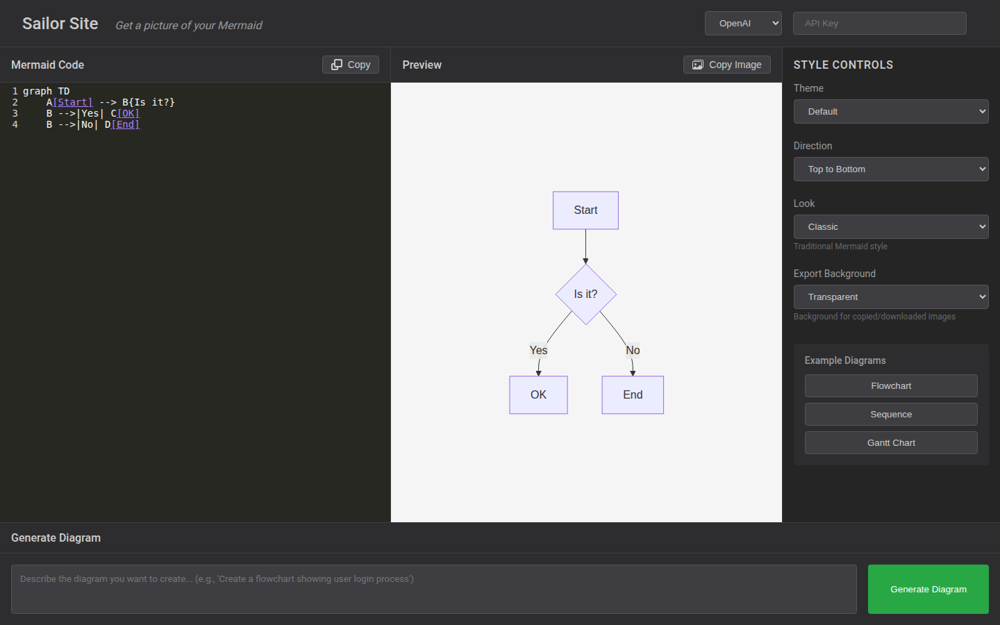
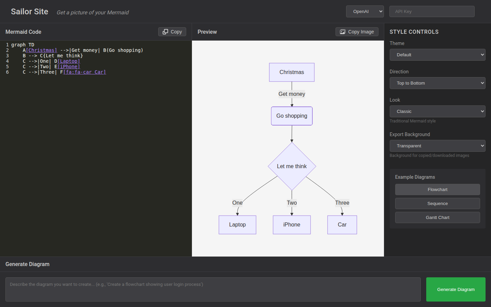
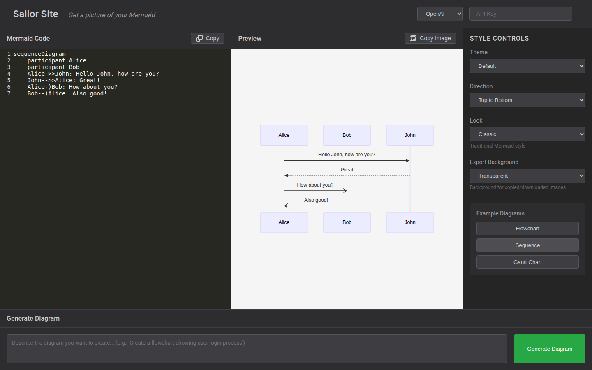
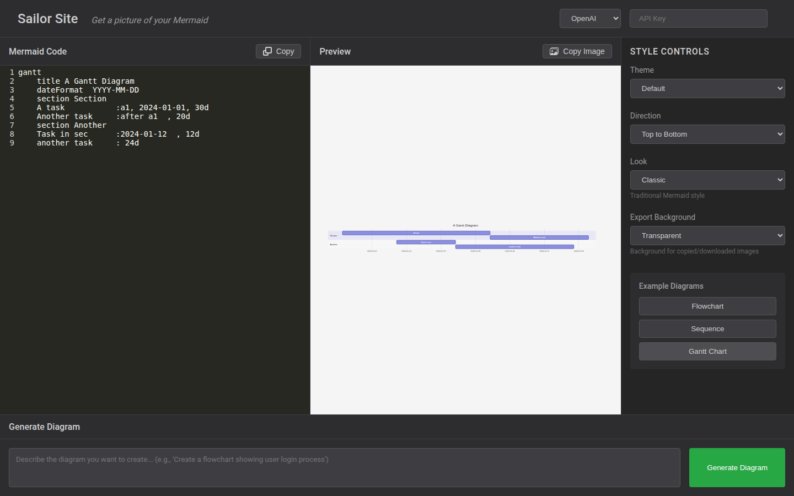
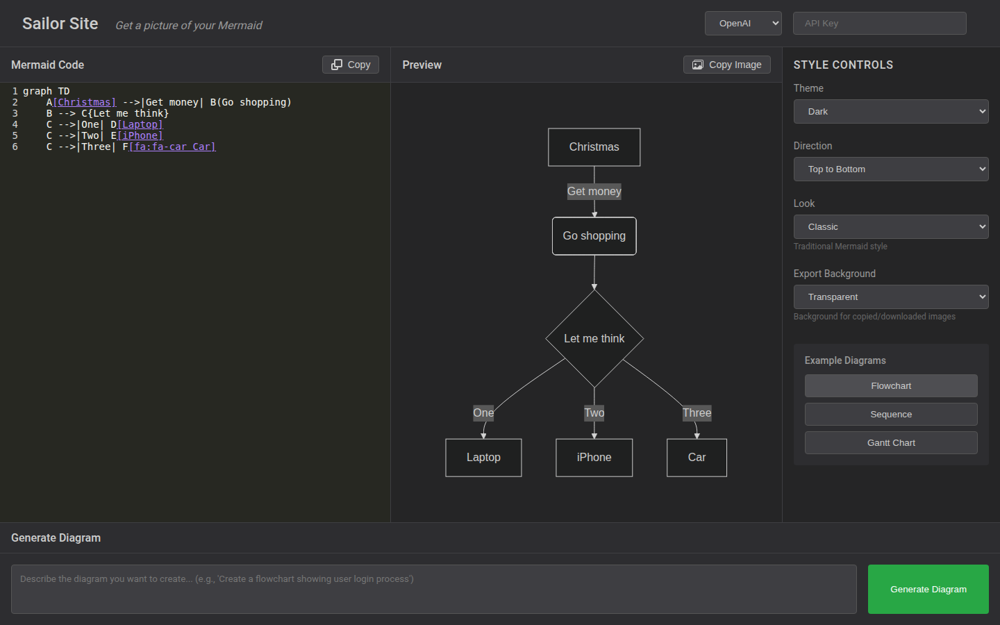
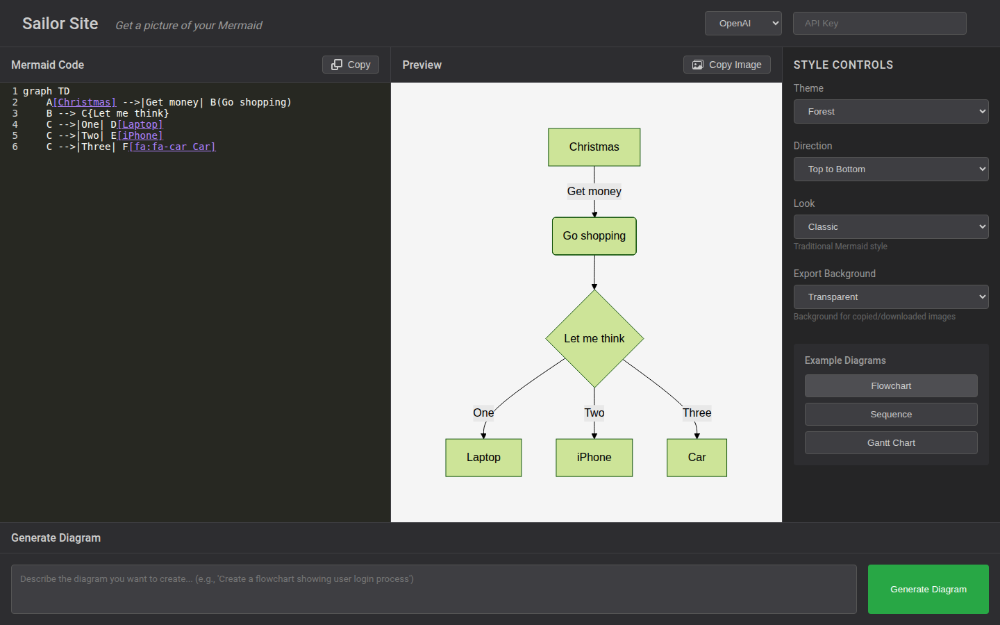
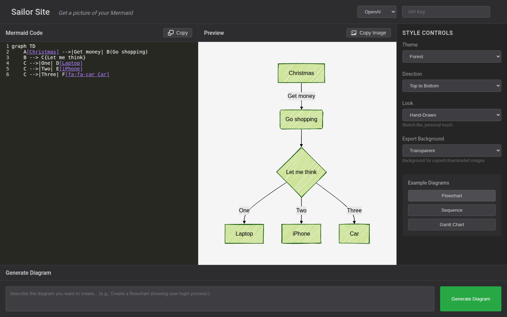
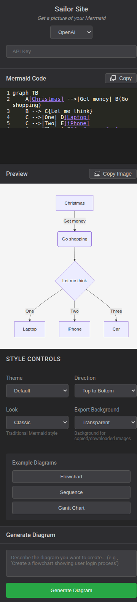

# Sailor Showcase

See what Sailor can do. Every screenshot below was captured from a live instance of the Sailor web UI.

---

## The Editor

Sailor gives you a split-pane interface: a code editor on the left with syntax highlighting (CodeMirror), a live preview in the center, and style controls on the right. The bottom panel lets you describe diagrams in plain English and generate them with AI.

  
  
The main interface with a simple flowchart loaded

---

## Diagram Types

Sailor supports all major Mermaid diagram types out of the box. Click an example button and the code + preview update instantly.

### Flowcharts

Decision trees, process flows, and workflows with branching logic. Supports rectangles, rounded boxes, diamonds, and labeled edges.

  
  
Flowchart with decision nodes, labeled edges, and multiple branches

### Sequence Diagrams

Model interactions between participants over time. Supports synchronous calls, async responses, and different arrow styles.

  
  
Sequence diagram with multiple participants and message types

### Gantt Charts

Plan and visualize project timelines with tasks, dependencies, and sections.

  
  
Gantt chart with task dependencies and date-based scheduling

---

## Themes

Switch between four built-in Mermaid themes to match your project's style. The preview background adapts automatically.

### Dark Theme

High-contrast diagrams on a dark background, ideal for dark-mode presentations.

  
  
Dark theme - clean, high-contrast rendering

### Forest Theme

A nature-inspired green palette with warm tones.

  
  
Forest theme - green palette for a natural feel

---

## Hand-Drawn Look

Toggle between Classic and Hand-Drawn rendering. Hand-Drawn mode gives diagrams a sketch-like, whiteboard aesthetic.

  
  
Hand-Drawn look combined with Forest theme for a whiteboard feel

---

## Direction Control

Change the flow direction of your diagrams: Top-to-Bottom, Bottom-to-Top, Left-to-Right, or Right-to-Left. The code updates automatically.

  
  
Left-to-Right layout - great for horizontal process flows

---

## Responsive Design

Sailor works on screens of every size. On mobile, panels stack vertically and controls reflow into a compact grid.

  
  
Mobile view (375px) - fully responsive layout

---

## AI-Powered Generation

Type a plain-English description in the bottom panel, connect your OpenAI or Anthropic API key, and click **Generate Diagram**. Sailor sends your description to the AI and renders the result instantly.

Supported providers:
- **OpenAI** (GPT-4)
- **Anthropic** (Claude 3.5 Sonnet)

---

## MCP Server Integration

Beyond the web UI, Sailor runs as an MCP (Model Context Protocol) server that integrates directly with Claude Desktop. This gives you 11 tools for diagram generation, validation, rendering, and analysis -- all through natural language conversation.

| Tool | Description |
|------|-------------|
| `validate_and_render_mermaid` | Validate and render Mermaid code to PNG |
| `get_diagram` | Retrieve a rendered diagram by file ID |
| `request_mermaid_generation` | Generate Mermaid code from a description |
| `get_mermaid_examples` | Browse example diagrams |
| `get_diagram_template` | Get customizable starter templates |
| `get_syntax_help` | Syntax reference for any diagram type |
| `analyze_diagram_code` | Analyze code and suggest improvements |
| `suggest_diagram_improvements` | Get targeted improvement suggestions |
| `health_check` | Check server health |
| `server_status` | Full server status report |

---

## Additional Features

- **Copy Code** -- one-click copy of Mermaid source to clipboard
- **Copy Image** -- export the rendered diagram as a high-resolution PNG
- **Export Background** -- choose transparent or white background for exports
- **Real-time Preview** -- diagrams re-render as you type with 500ms debounce
- **API Key Validation** -- keys are verified against the provider before use
- **Rate Limiting** -- built-in protection against API abuse
- **Docker Deployment** -- ship as a container with `docker-compose up`

---

  <h2 style="color: white; border: none; margin-bottom: 1rem;">Ready to try it?</h2>
  
Get Sailor running in minutes.

  <a href="setup-guide" style="display: inline-block; background: white; color: #0066cc; padding: 0.75rem 2rem; border-radius: 4px; text-decoration: none; font-weight: bold;">
    Setup Guide
  </a>

