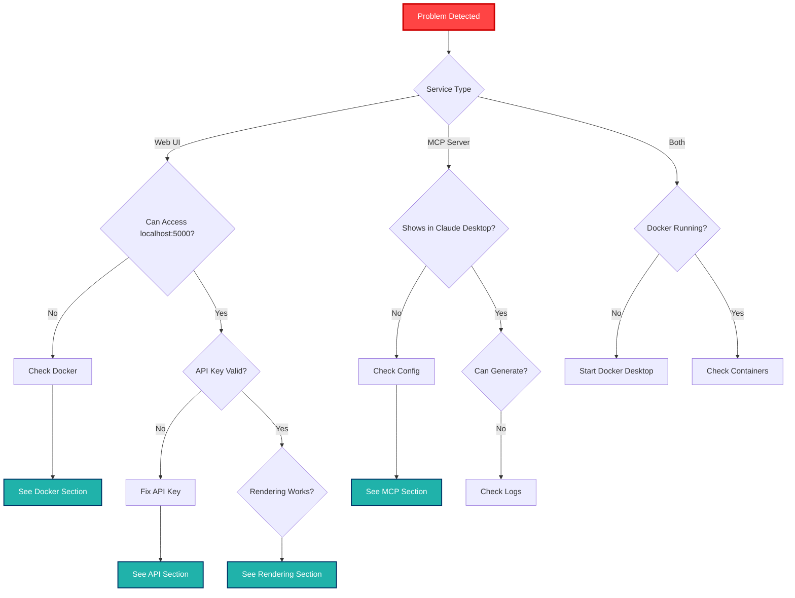
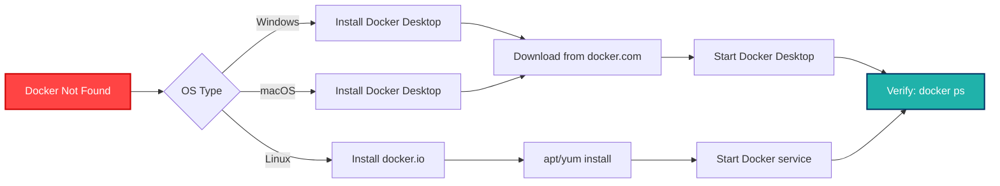
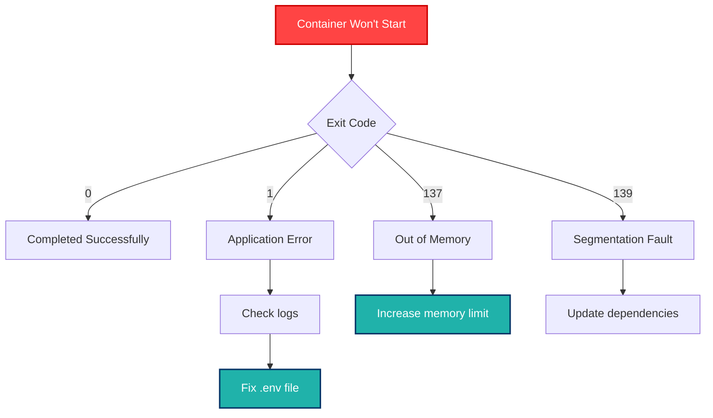
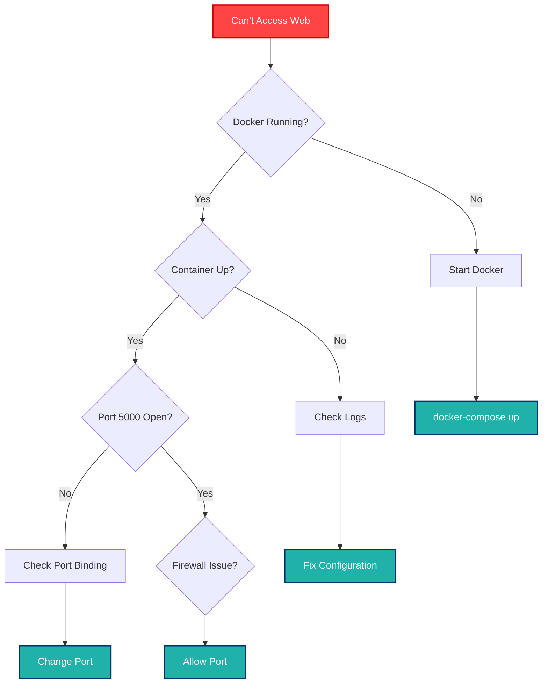
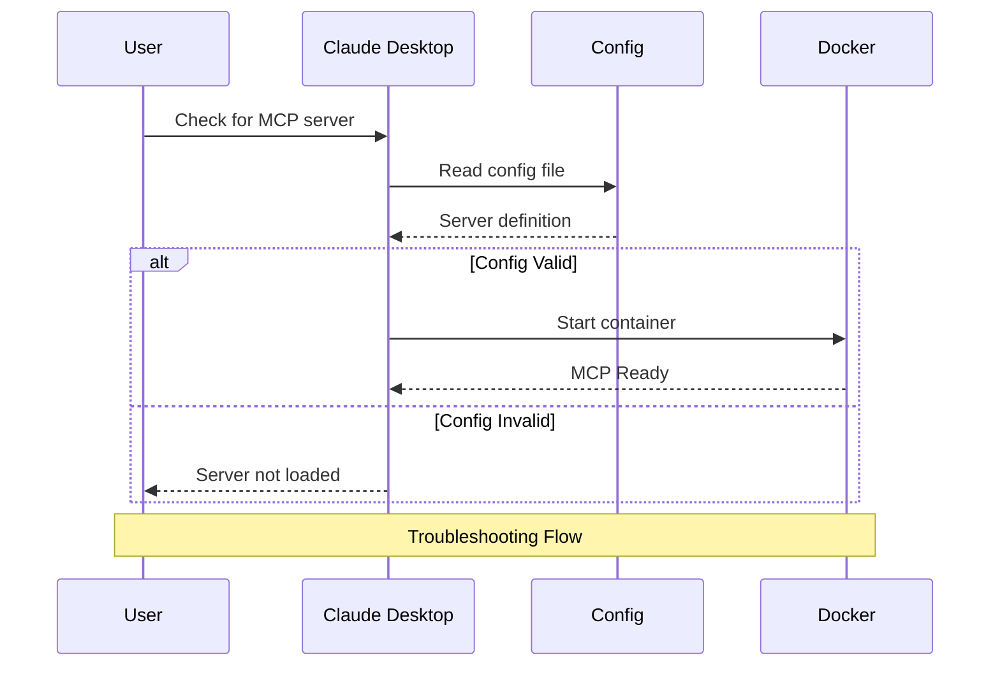
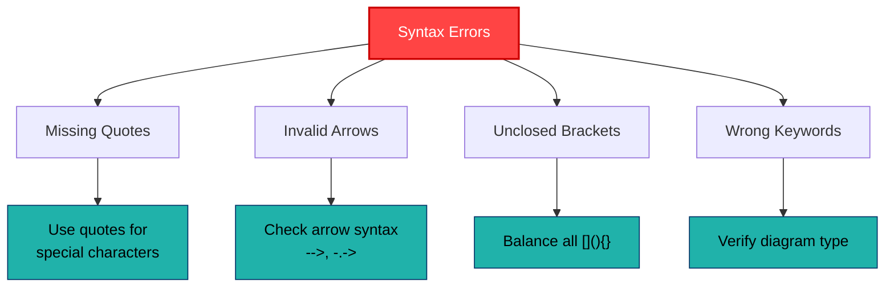
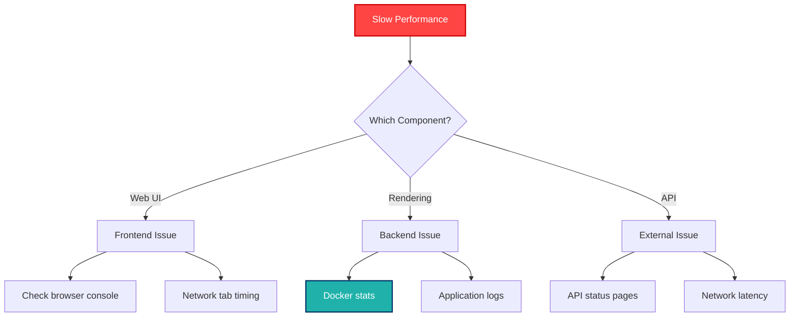
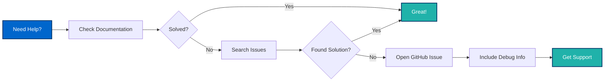

# Troubleshooting Guide 🔧

This guide provides solutions to common issues you may encounter while using Sailor. Follow the diagnostic flowcharts and solutions to resolve problems quickly.

## Table of Contents

- [Quick Diagnostic](#quick-diagnostic)
- [Installation Issues](#installation-issues)
- [Docker Problems](#docker-problems)
- [Web Interface Issues](#web-interface-issues)
- [Claude Desktop Integration](#claude-desktop-integration)
- [Rendering Problems](#rendering-problems)
- [API Connectivity](#api-connectivity)
- [Performance Issues](#performance-issues)
- [Debug Mode](#debug-mode)

---

## Quick Diagnostic

### Problem Diagnosis Flowchart



### Quick Health Check

Run these commands to quickly diagnose issues:

```bash
# Check Docker
docker --version
docker ps

# Check Sailor containers
docker-compose ps

# Check web interface
curl -I http://localhost:5000

# Check logs
docker-compose logs --tail=50

# Check MCP image
docker images | grep sailor-mcp
```

---

## Installation Issues

### Issue: Git Clone Fails

**Symptoms:**
- `fatal: repository not found`
- Connection timeout

**Solutions:**

```bash
# Verify internet connection
ping github.com

# Try HTTPS instead of SSH
git clone https://github.com/aj-geddes/sailor.git

# Check firewall/proxy settings
git config --global http.proxy http://proxy.example.com:8080

# Use alternative URL
git clone git@github.com:aj-geddes/sailor.git
```

### Issue: Docker Not Found

**Symptoms:**
- `docker: command not found`
- `Cannot connect to Docker daemon`

**Solutions:**



**Windows/macOS:**
```bash
# Download from https://www.docker.com/products/docker-desktop

# Verify installation
docker --version
docker-compose --version
```

**Linux:**
```bash
# Install Docker
sudo apt update
sudo apt install docker.io docker-compose

# Start Docker service
sudo systemctl start docker
sudo systemctl enable docker

# Add user to docker group
sudo usermod -aG docker $USER
newgrp docker

# Verify
docker ps
```

### Issue: Permission Denied

**Symptoms:**
- `permission denied while trying to connect to the Docker daemon`

**Solutions:**

```bash
# Linux: Add user to docker group
sudo usermod -aG docker $USER
newgrp docker

# Or run with sudo (not recommended for production)
sudo docker-compose up

# Check Docker socket permissions
ls -la /var/run/docker.sock
```

---

## Docker Problems

### Issue: Containers Won't Start

**Symptoms:**
- `docker-compose up` fails
- Containers exit immediately

**Diagnostic Steps:**

```bash
# Check container status
docker-compose ps

# View detailed logs
docker-compose logs

# Check specific service
docker-compose logs web

# Inspect failed container
docker inspect sailor-web
```

**Common Causes & Solutions:**



**Solution 1: Configuration Error**
```bash
# Check .env file exists
ls -la backend/.env

# Verify required variables
cat backend/.env | grep -E "SECRET_KEY|FLASK"

# Recreate from template
cp backend/.env.example backend/.env
# Edit with your values
```

**Solution 2: Port Already in Use**
```bash
# Check what's using port 5000
lsof -i :5000  # macOS/Linux
netstat -ano | findstr :5000  # Windows

# Kill the process or change port in docker-compose.yml
```

**Solution 3: Rebuild Containers**
```bash
# Clean rebuild
docker-compose down
docker-compose build --no-cache
docker-compose up -d
```

### Issue: Out of Disk Space

**Symptoms:**
- `no space left on device`
- Containers fail to build

**Solutions:**

```bash
# Check Docker disk usage
docker system df

# Remove unused containers
docker container prune

# Remove unused images
docker image prune -a

# Remove unused volumes
docker volume prune

# Complete cleanup (careful!)
docker system prune -a --volumes

# Check system disk space
df -h
```

### Issue: Network Errors

**Symptoms:**
- Containers can't communicate
- DNS resolution fails

**Solutions:**

```bash
# Recreate network
docker-compose down
docker network prune
docker-compose up -d

# Check network
docker network ls
docker network inspect sailor_default

# Test connectivity
docker exec sailor-web ping google.com
```

---

## Web Interface Issues

### Issue: Can't Access Web Interface

**Symptoms:**
- Browser shows "Connection refused"
- `localhost:5000` times out

**Troubleshooting Flowchart:**



**Solutions:**

```bash
# 1. Verify container is running
docker-compose ps
# Look for "Up" status

# 2. Check port binding
docker port sailor-web
# Should show: 5000/tcp -> 0.0.0.0:5000

# 3. Test from inside container
docker exec sailor-web curl -I localhost:5000

# 4. Check logs for errors
docker-compose logs web

# 5. Try different browser
# Try incognito/private mode

# 6. Check firewall (Linux)
sudo ufw allow 5000/tcp

# 7. Restart service
docker-compose restart web
```

### Issue: API Key Invalid

**Symptoms:**
- "Invalid API key" error
- 401 Unauthorized responses

**Solutions:**

```bash
# 1. Verify key format
# OpenAI: starts with sk-proj-
# Anthropic: starts with sk-ant-

# 2. Check .env file
cat backend/.env | grep API_KEY

# 3. Test key directly
# OpenAI:
curl https://api.openai.com/v1/models \
  -H "Authorization: Bearer YOUR_KEY"

# Anthropic:
curl https://api.anthropic.com/v1/messages \
  -H "x-api-key: YOUR_KEY" \
  -H "anthropic-version: 2023-06-01" \
  -H "content-type: application/json" \
  -d '{"model":"claude-3-sonnet-20240229","max_tokens":1024,"messages":[{"role":"user","content":"Hi"}]}'

# 4. Regenerate key from provider
# 5. Update .env and restart
docker-compose restart web
```

### Issue: 500 Internal Server Error

**Symptoms:**
- Server error page
- Stack traces in logs

**Diagnostic Steps:**

```bash
# 1. Check detailed logs
docker-compose logs -f web

# 2. Enable debug mode temporarily
# In backend/.env:
FLASK_DEBUG=1

# Restart
docker-compose restart web

# 3. Check Python errors
docker exec sailor-web python -c "import flask; print(flask.__version__)"

# 4. Test dependencies
docker exec sailor-web pip list
```

---

## Claude Desktop Integration

### Issue: MCP Server Not Appearing

**Symptoms:**
- Sailor-mermaid not in Claude Desktop tools
- No MCP servers showing

**Troubleshooting Steps:**



**Solutions:**

**1. Verify Docker Image Exists:**
```bash
docker images | grep sailor-mcp
# If not found, build it:
docker build -f Dockerfile.mcp-stdio -t sailor-mcp .
```

**2. Check Config File Location:**

| OS | Path |
|----|------|
| Windows | `%APPDATA%\Claude\claude_desktop_config.json` |
| macOS | `~/Library/Application Support/Claude/claude_desktop_config.json` |
| Linux | `~/.config/Claude/claude_desktop_config.json` |

**3. Validate JSON Syntax:**
```bash
# Linux/macOS
cat "~/Library/Application Support/Claude/claude_desktop_config.json" | jq .

# Or use online JSON validator
```

**4. Correct Configuration Format:**
```json
{
  "mcpServers": {
    "sailor-mermaid": {
      "command": "docker",
      "args": [
        "run",
        "-i",
        "--rm",
        "-v",
        "/absolute/path/to/output:/output",
        "sailor-mcp"
      ]
    }
  }
}
```

**5. Common Config Mistakes:**
- ❌ Relative paths in volume mounts
- ❌ Missing quotes around paths with spaces
- ❌ Wrong image name (sailor-mcp, not sailor-web)
- ❌ Missing `-i` flag for interactive mode

**6. Restart Claude Desktop:**
```bash
# Completely quit (not just close window)
# On macOS: Cmd+Q
# On Windows: File > Exit
# Then reopen
```

**7. Check Docker Desktop:**
- Ensure Docker Desktop is running
- Check if containers can start:
  ```bash
  docker run -i --rm sailor-mcp echo "test"
  ```

### Issue: MCP Connection Fails

**Symptoms:**
- Server shows but commands fail
- "Connection lost" errors

**Solutions:**

```bash
# 1. Check Docker logs
docker ps -a | grep sailor-mcp
docker logs <container-id>

# 2. Test manual start
docker run -i --rm sailor-mcp

# 3. Check volume permissions
ls -la /path/to/output
# Ensure directory exists and is writable

# 4. Create output directory if missing
mkdir -p ~/Pictures/sailor-diagrams

# 5. Test with simpler config
{
  "mcpServers": {
    "sailor-test": {
      "command": "docker",
      "args": ["run", "-i", "--rm", "sailor-mcp"]
    }
  }
}
```

### Issue: Diagrams Not Saving

**Symptoms:**
- Generation succeeds but file not found
- Permission denied errors

**Solutions:**

```bash
# 1. Verify output directory exists
mkdir -p ~/Pictures/sailor-diagrams

# 2. Check permissions
ls -la ~/Pictures/sailor-diagrams
chmod 755 ~/Pictures/sailor-diagrams

# 3. Use absolute path in config
# Wrong: "./output" or "~/Pictures"
# Right: "/Users/yourname/Pictures" (macOS)
# Right: "C:\\Users\\YourName\\Pictures" (Windows)

# 4. Test volume mount
docker run --rm -v "/Users/yourname/Pictures:/output" alpine ls -la /output
```

---

## Rendering Problems

### Issue: Mermaid Syntax Errors

**Symptoms:**
- "Invalid syntax" errors
- Blank diagrams
- Parse errors

**Common Syntax Issues:**



**Validation Steps:**

```bash
# 1. Test in Mermaid Live Editor
# https://mermaid.live

# 2. Check quotes for special characters
# Wrong: graph TD; A[Text with: colon]
# Right: graph TD; A["Text with: colon"]

# 3. Verify diagram type
# flowchart, sequenceDiagram, classDiagram, etc.

# 4. Check arrow syntax
# Solid: -->
# Dotted: -.->
# Thick: ==>
```

### Issue: Rendering Timeout

**Symptoms:**
- "Rendering failed" after long wait
- Timeout errors

**Solutions:**

```bash
# 1. Increase timeout in MCP server
# Edit src/sailor_mcp/renderer.py
# Increase timeout value

# 2. Simplify diagram
# Break complex diagrams into smaller parts

# 3. Check browser resources
docker stats sailor-web

# 4. Increase container memory
# In docker-compose.yml:
services:
  web:
    deploy:
      resources:
        limits:
          memory: 2G

# 5. Check Playwright installation
docker exec sailor-web playwright --version
```

### Issue: Rendering Quality Poor

**Symptoms:**
- Blurry images
- Cut-off text
- Wrong colors

**Solutions:**

```bash
# 1. Increase resolution
# Use scale parameter in render options

# 2. Check theme settings
# Try different themes: default, dark, forest, neutral

# 3. Verify background color
# Use transparent or white background

# 4. Check browser version
docker exec sailor-web chromium --version
```

---

## API Connectivity

### Issue: OpenAI API Errors

**Common Error Messages:**

| Error | Cause | Solution |
|-------|-------|----------|
| `401 Unauthorized` | Invalid API key | Check key format, regenerate |
| `429 Too Many Requests` | Rate limit exceeded | Wait or upgrade plan |
| `500 Server Error` | OpenAI service issue | Check status.openai.com |
| `503 Service Unavailable` | Overloaded | Retry with backoff |

**Testing:**

```bash
# Test API key
curl https://api.openai.com/v1/models \
  -H "Authorization: Bearer YOUR_KEY" \
  | jq .

# Check rate limits
curl -I https://api.openai.com/v1/models \
  -H "Authorization: Bearer YOUR_KEY" \
  | grep -i rate
```

### Issue: Anthropic API Errors

**Common Error Messages:**

| Error | Cause | Solution |
|-------|-------|----------|
| `401 authentication_error` | Invalid key | Verify sk-ant- prefix |
| `429 rate_limit_error` | Too many requests | Implement backoff |
| `400 invalid_request_error` | Bad parameters | Check request format |

**Testing:**

```bash
# Test API key
curl https://api.anthropic.com/v1/messages \
  -H "x-api-key: YOUR_KEY" \
  -H "anthropic-version: 2023-06-01" \
  -H "content-type: application/json" \
  -d '{"model":"claude-3-sonnet-20240229","max_tokens":1024,"messages":[{"role":"user","content":"Hi"}]}' \
  | jq .
```

### Issue: Network/Proxy Problems

**Symptoms:**
- Connection timeouts
- SSL certificate errors
- "Name resolution failed"

**Solutions:**

```bash
# 1. Check internet connectivity
docker exec sailor-web ping -c 3 api.openai.com

# 2. Configure proxy in .env
HTTP_PROXY=http://proxy.example.com:8080
HTTPS_PROXY=http://proxy.example.com:8080

# 3. Test DNS resolution
docker exec sailor-web nslookup api.openai.com

# 4. Check firewall rules
# Allow outbound HTTPS (443) to:
# - api.openai.com
# - api.anthropic.com

# 5. Verify SSL certificates
docker exec sailor-web curl -v https://api.openai.com 2>&1 | grep SSL
```

---

## Performance Issues

### Issue: Slow Response Times

**Performance Diagnosis:**



**Solutions:**

```bash
# 1. Check resource usage
docker stats

# 2. Increase resources
# In docker-compose.yml:
deploy:
  resources:
    limits:
      cpus: '2.0'
      memory: 2G

# 3. Check disk I/O
docker exec sailor-web iostat

# 4. Monitor API latency
time curl -X POST http://localhost:5000/generate \
  -H "Content-Type: application/json" \
  -d '{"description":"test"}'

# 5. Enable caching (if available)

# 6. Check logs for slow queries
docker-compose logs web | grep -i "slow"
```

### Issue: High Memory Usage

**Symptoms:**
- Container OOM (Out of Memory)
- System becomes unresponsive

**Solutions:**

```bash
# 1. Check current usage
docker stats sailor-web --no-stream

# 2. Increase memory limit
# docker-compose.yml:
services:
  web:
    mem_limit: 2g

# 3. Check for memory leaks
docker exec sailor-web ps aux

# 4. Restart container
docker-compose restart web

# 5. Monitor over time
watch -n 5 'docker stats sailor-web --no-stream'
```

---

## Debug Mode

### Enabling Debug Mode

**For Web Interface:**

```bash
# 1. Edit backend/.env
FLASK_DEBUG=1
LOG_LEVEL=DEBUG

# 2. Restart service
docker-compose restart web

# 3. View detailed logs
docker-compose logs -f web
```

**For MCP Server:**

```json
{
  "mcpServers": {
    "sailor-mermaid": {
      "command": "docker",
      "args": [
        "run",
        "-i",
        "--rm",
        "-e", "LOG_LEVEL=DEBUG",
        "-e", "MCP_DEBUG=1",
        "-v", "/path/to/output:/output",
        "sailor-mcp"
      ]
    }
  }
}
```

### Collecting Debug Information

When reporting issues, collect this information:

```bash
# Create debug report
cat > debug-report.txt <<EOF
=== System Information ===
OS: $(uname -a)
Docker: $(docker --version)
Docker Compose: $(docker-compose --version)

=== Sailor Version ===
$(docker exec sailor-web python -c "print('2.0.0')" 2>/dev/null || echo "Not running")

=== Container Status ===
$(docker-compose ps)

=== Recent Logs ===
$(docker-compose logs --tail=100)

=== Environment (sanitized) ===
$(docker exec sailor-web env | grep -v KEY)

=== Resource Usage ===
$(docker stats --no-stream)

=== Disk Space ===
$(df -h)
EOF

echo "Debug report saved to debug-report.txt"
```

---

## Getting Help

### Before Requesting Support

- [ ] Checked this troubleshooting guide
- [ ] Reviewed relevant documentation
- [ ] Searched existing GitHub issues
- [ ] Collected debug information
- [ ] Tried suggested solutions

### How to Get Help



**GitHub Issues:**
1. [Search existing issues](https://github.com/aj-geddes/sailor/issues)
2. [Open new issue](https://github.com/aj-geddes/sailor/issues/new)
3. Include:
   - Problem description
   - Steps to reproduce
   - Expected vs actual behavior
   - Debug report
   - System information

---

## Quick Reference Commands

```bash
# Health check
curl -f http://localhost:5000/health

# View logs
docker-compose logs -f

# Restart service
docker-compose restart

# Rebuild and restart
docker-compose up -d --build

# Clean everything
docker-compose down
docker system prune -a

# Test MCP image
docker run -i --rm sailor-mcp echo "test"

# Check container status
docker-compose ps

# Resource usage
docker stats

# Debug mode
FLASK_DEBUG=1 docker-compose up
```

---

[← Operations Guide](operations-guide) | [Back to Home](index)
