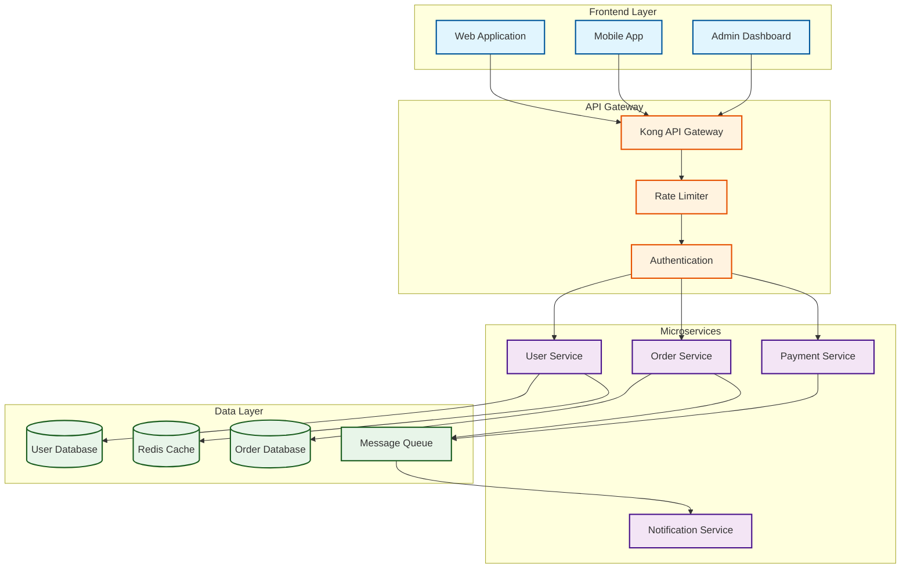
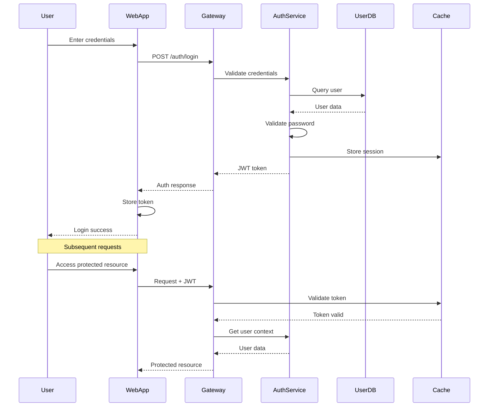
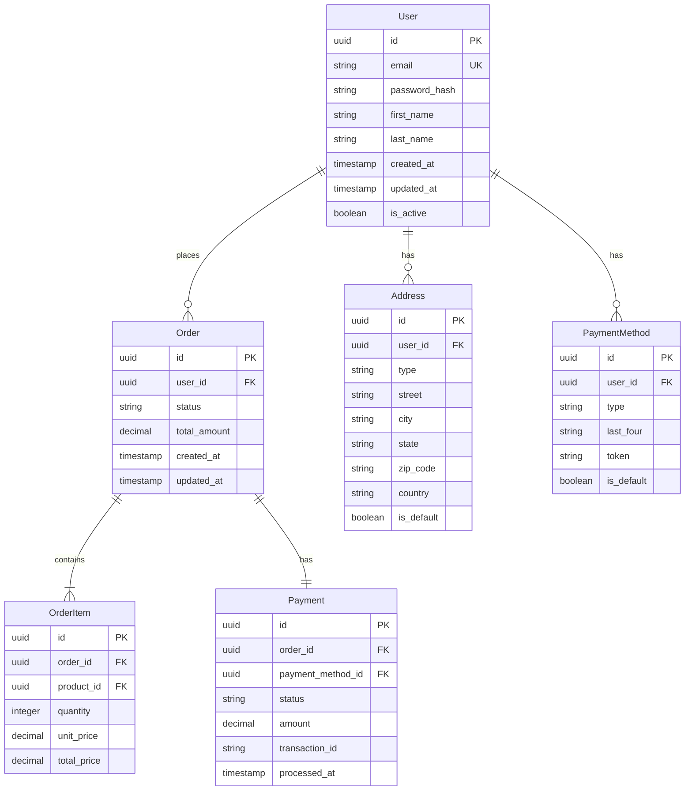
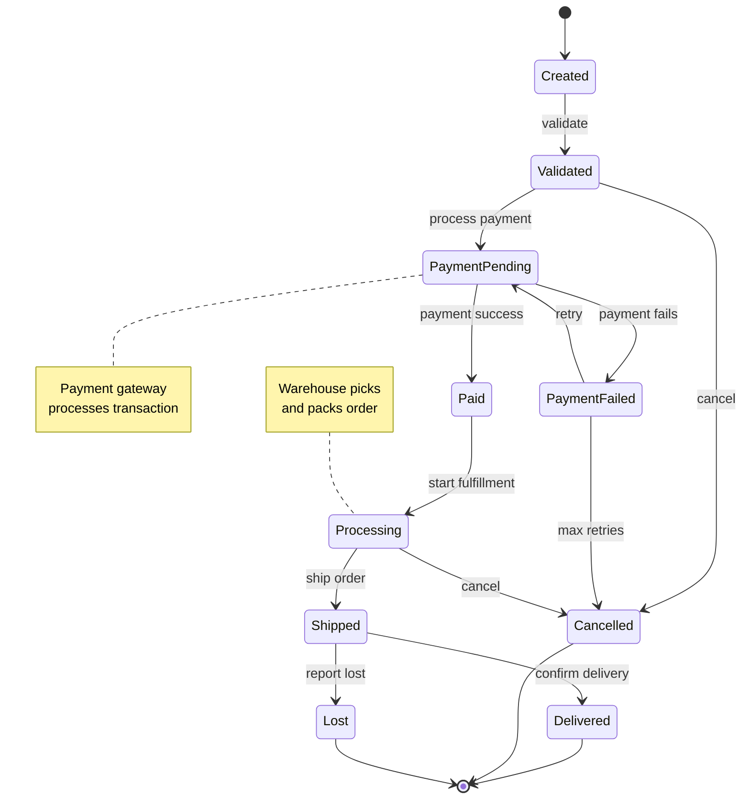

# Welcome to Sailor Documentation Example

This site demonstrates how to integrate Sailor with Jekyll for automatic Mermaid diagram generation.

## System Architecture

Our example system uses a microservices architecture:

## Authentication Flow

Here's how authentication works in our system:

## Database Schema

Our user service database schema:

## State Machine Example

Order processing state machine:

## Generated Diagrams

After processing with Sailor, these diagrams are converted to images and available at:

- [System Architecture](./diagrams/index_diagram_1.png)
- [Authentication Flow](./diagrams/index_diagram_2.png)
- [Database Schema](./diagrams/index_diagram_3.png)
- [State Machine](./diagrams/index_diagram_4.png)

## Learn More

- [Sailor Documentation](https://github.com/aj-geddes/sailor)
- [Mermaid Documentation](https://mermaid.js.org)
- [Jekyll Documentation](https://jekyllrb.com)