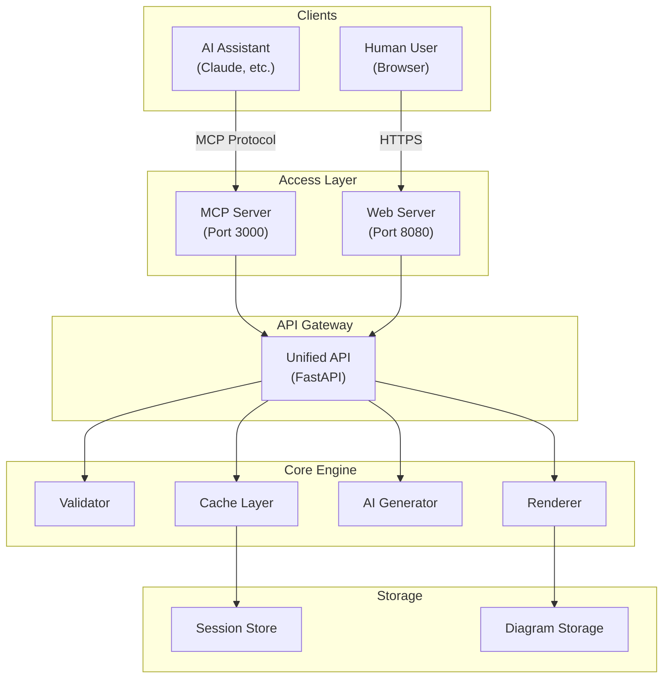

# Sailor UI - Dual-Mode Architecture

## Overview
Sailor UI is designed to work in two modes:
1. **MCP Mode**: For AI assistants (Claude, etc.) via Model Context Protocol
2. **Web Mode**: For humans via a beautiful Svelte frontend

Both modes share the same core engine, ensuring consistency.

## Architecture



## Dual-Mode Features

### For AI Assistants (MCP Mode)
- **Tools**:
  - `create_diagram`: Generate from description
  - `validate_mermaid`: Check syntax
  - `render_diagram`: Get PNG/SVG
  - `list_examples`: Get templates
  - `share_diagram`: Get shareable link

- **Resources**:
  - `diagram://recent`: Recent diagrams
  - `diagram://shared/{id}`: Shared diagrams
  - `template://`: Diagram templates

### For Humans (Web Mode)
- **Real-time editing** with live preview
- **AI assistance** for natural language input
- **Visual theme picker**
- **Collaboration** features
- **Export** in multiple formats

## Unified API Design

```python
# Core API endpoints used by both modes
POST   /api/v1/diagram/create
POST   /api/v1/diagram/validate  
POST   /api/v1/diagram/render
GET    /api/v1/diagram/{id}
POST   /api/v1/diagram/{id}/share
GET    /api/v1/templates
POST   /api/v1/ai/suggest
```

## Implementation Plan

### Phase 1: Core Engine
- Unified diagram validation
- High-performance rendering
- Caching layer

### Phase 2: MCP Server
- Full MCP protocol compliance
- Tool implementations
- Resource handlers

### Phase 3: Web Frontend
- Svelte UI components
- Real-time WebSocket updates
- Progressive enhancement

### Phase 4: Advanced Features
- Collaboration
- Version control
- Export integrations